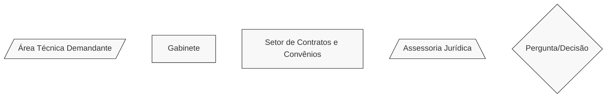
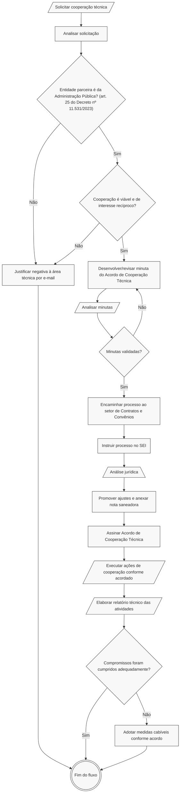

# 🧩 Acordo de Cooperação Técnica

## 💎 Dicas

| Item                                                     | Resposta  |
|----------------------------------------------------------|-----------|
| **📢 Precisa de Chamamento Público?**                           | Não, pois é firmado entre entidades públicas e não envolve transferências de recursos ou doação de bens materiais |
| **🤝 Tipos de parceiros**                                       | • Órgãos públicos (todas as esferas)   • Consórcios públicos   • Serviços Sociais Autônomos (SSAs) |
| **💰 Envolve transferência de recursos ou doação de bens materiais?** | • Não (arts. 2º, XIII e 24, I do [Decreto Federal nº 11.531/2023](https://www.planalto.gov.br/ccivil_03/_ato2023-2026/2023/decreto/d11531.htm)) |
| **⏳ Vigência máxima**                                          | • Não há limite máximo fixado em decreto   • Varia de acordo com a complexidade do objeto   • Recomenda-se 2 anos |
| **🔒 Exige prestação de contas formal? Qual?**                  | • Não exige prestação de contas financeira   • Porém, recomenda-se relatório técnico simplificado sobre as atividades |
| **👮🏻 Exige servidor designado como gestor/fiscal/equivalente?**    | • Não   • Porém, recomenda-se designação de gestor e fiscal na unidade demandante da parceria para facilitar a execução e o monitoramento |
| **🛣️ Plano de trabalho obrigatório?** | Não, mas é recomendável para facilitar o monitoramento da execução |

---

## 📌 Definição:
Instrumento de cooperação para a execução de ações de interesse recíproco e em regime de mútua colaboração, a título gratuito, sem transferência de recursos ou doação de bens, no qual o objeto e as condições da cooperação são ajustados de comum acordo entre as partes.

**Atenção!** Acordos de Cooperação Técnica (ACTs) só poderão ser celebrados entre órgãos públicos (de qualquer esfera - municipal, estadual e federal), consórcios públicos ou Serviços Sociais Autônomos estabelecidos por lei (SSAs, como o [Servas](https://www.almg.gov.br/legislacao-mineira/texto/LEI/22607/2017/?cons=1), por exemplo).

---

## 🏛️ Regulamentação:
Capítulo III - Das Parcerias sem Transferências de Recursos - do [Decreto Federal nº 11.531/2023](https://www.planalto.gov.br/ccivil_03/_ato2023-2026/2023/decreto/d11531.htm).

---

## 🎯 Objetivos

- Executar políticas públicas de interesse recíproco em mútua colaboração.
- Potencializar capacidades institucionais através da cooperação técnica.
- Facilitar parcerias sem necessidade de repasse de recursos.
- Promover sinergia entre diferentes esferas da administração pública.
- Fomentar iniciativas baseadas em colaboração técnica e operacional.

---

## 🛠️ Exemplos de aplicação no Iepha-MG:

Desde que haja interesse mútuo e viabilidade técnica, um Acordo de Cooperação Técnica pode servir para:

1. Cooperação técnica em projetos de inventário e preservação do patrimônio.
2. Intercâmbio de conhecimentos especializados em restauro e conservação.
3. Desenvolvimento conjunto de metodologias de gestão patrimonial.
4. Parcerias para capacitação e qualificação de servidores.
5. Compartilhamento de expertise em digitalização de acervos.
6. Projetos colaborativos de educação patrimonial.
7. Cooperação em pesquisas sobre patrimônio cultural mineiro.

---

## 📋 Regras

=== "✅ Pode"

    **Características do instrumento:**

    - Estabelecer cooperação técnica sem transferência de recursos.
    - Formalizar parcerias baseadas em interesse recíproco.
    - Combinar esforços, conhecimentos e capacidades técnicas.
    - Compartilhar experiências, metodologias e boas práticas.

    **Partes que podem celebrar** (art. 25 do Decreto nº 11.531/2023):

    - Órgãos e entidades da administração pública federal, estadual, distrital e municipal.
    - Serviços sociais autônomos.
    - Consórcios públicos.

=== "❌ Não pode"

    ⚠️ **Limitações:**  

    - Não envolve transferência de recursos públicos (art. 24, parágrafo único).
    - Não envolve doação de bens materiais.
    - Não substitui procedimentos de contratação quando há fornecimento oneroso.

    ⚠️ **Características específicas:**  

    - As despesas relacionadas à execução não configuram transferência de recursos, devendo correr à conta de cada parte (art. 24, parágrafo único).
    - Instrumento exclusivamente gratuito.
    - Não gera obrigações financeiras entre as partes.

---

## ✒️ Celebração

Decisão discricionária da administração pública baseada em análise de interesse comum e viabilidade da cooperação técnica.

---

## 🪪 Documentação e cláusulas

Por se tratar de instrumento sem transferência de recursos, dispensa documentação complexa. Em suma, exige-se do parceiro a apresentação de estatuto válido, de algumas CNDs e de ata de posse do dirigente que assinará o instrumento jurídico. 

Quanto ao instrumento jurídico a ser assinado, algumas cláusulas não podem:

- Identificação das partes (preâmbulo)
- Descrição clara do objeto da cooperação
- Definição das responsabilidades de cada parte
- Regras de monitoramento e avaliação
- Prazo de vigência
- Resultados esperados (anexo)

---

## 🛣️ Plano de trabalho {#plano-de-trabalho}

Não é obrigatório - mas é boa prática - constar um *plano de trabalho simplificado*, com:

- Ações objetivas visando ao cumprimento do objeto da cooperação
- Prazos para início e término de cada ação
- Responsáveis pela ação
- Fontes de comprovação (documentos, fotografias, relatórios, publicações etc. que atestem a realização daquela atividade)

A melhor forma de fazer isso é redigindo uma tabela simples, conforme o exemplo abaixo:

| Item | Ação | Responsável | Início | Término | Fonte de comprovação |
| ---- | ---- | ----------- | ------ | ------- | -------------------- |
| 1    | (Exemplo): levantar bens tombados para mapeamento | IEPHA-MG | Mês 1 | Mês 2 | Mapeamento assinado no SEI |
| 2    | (Exemplo): indicar bens prioritários conforme situação de conservação | Entidade parceira | Mês 3 | Mês 4 | Lista de prioridades tramitada no SEI |
| ...    | ... | ... | ... | Último mês da vigência | ... |

---

## 🔒 Prestação de contas

Não é exigida prestação de contas financeira, uma vez que o instrumento não envolve transferência de recursos. Pode ser estabelecida apresentação de relatórios técnicos sobre as atividades desenvolvidas, conforme acordado entre as partes.

**Conteúdo sugerido para relatórios técnicos:**

- Descrição das atividades realizadas
- Resultados alcançados na cooperação
- Benefícios mútuos obtidos
- Produtos ou conhecimentos desenvolvidos
- Avaliação qualitativa da parceria

---

## 🔍 Saiba mais!
Modelos e documentos de referência podem ser encontrados em nossa [Biblioteca](../../biblioteca/index.md).

- [Minuta modelo de Acordo de Cooperação Técnica da Advocacia Geral da União (AGU)](https://www.gov.br/agu/pt-br/composicao/cgu/cgu/modelos/conveniosecongeneres/acordo-de-cooperacao-tecnica.pdf)

> **🗝️ Dica:** o "texto padrão" n. 522228 no SEI é uma minuta de Acordo de Cooperação Técnica (ACT) já utilizada no âmbito do Iepha-MG. Ele contém:
>
> - Cláusulas padronizadas retiradas do modelo da AGU; e
> - Trechos sinalizados em azul para serem preenchidos conforme especificidades da parceria a ser firmada.
>
> Isso pode ajudar bastante na elaboração e na tramitação jurídica de um ACT.

---

## 🔄️ Fluxograma

Todos os procedimentos do fluxograma referem-se ao [Decreto Federal nº 11.531/2023](https://www.planalto.gov.br/ccivil_03/_ato2023-2026/2023/decreto/d11531.htm). Diferentes formatos das caixinhas significam diferentes setores responsáveis por cada atividade, conforme legenda.

