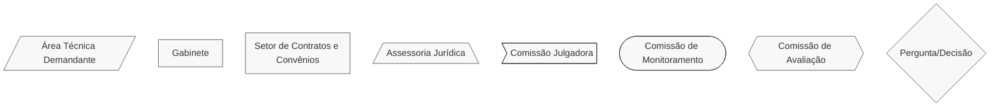

# 🏢 Contrato de Gestão (OS)

## 💎 Dicas

| Item | Resposta  |
|------|-----------|
| **📢 Precisa de Chamamento Público?**                       | Sim: obrigatório para seleção de OSs, salvo exceções legais – art. 60 da [Lei Estadual nº 23.081/2018](https://www.almg.gov.br/legislacao-mineira/texto/LEI/23081/2018/?cons=1) |
| **🤝 Tipos de parceiros**                                   | • Organizações Sociais (OS) <br> • Órgãos públicos estaduais como intervenientes (compõem Comissão de Avaliação / Monitoramento) |
| **💰 Envolve transferência de recursos ou doação de bens materiais?** | Sim: recursos financeiros e patrimoniais podem ser transferidos para execução do objeto da parceria, segundo metas, indicadores e programa de trabalho |
| **⏳ Vigência máxima**                                      | 20 anos, incluindo aditivos (art. 65, § 2º da [Lei 23.081/2018](https://www.almg.gov.br/legislacao-mineira/texto/LEI/23081/2018/?cons=1)) |
| **🔒 Exige prestação de contas formal? Qual?**              | • Checagens amostrais e de efetividade (usualmente trimestrais) <br> • Relatórios gerenciais financeiro e de resultados (idem) <br> • Relatórios de avaliação (idem) <br> • Prestação de contas anual <br> • Prestação de contas sob demanda (cf. art. 66 do [Decreto Estadual nº 47.553/2018](https://www.almg.gov.br/legislacao-mineira/texto/DEC/47553/2018/?cons=1)) <br> • Apresentação de documentos: relatórios gerenciais, extratos bancários, parecer conselho fiscal/OS, balanços patrimoniais, entre outros <br>  • Prestação de contas de extinção |
| **👮🏻 Exige servidor designado como gestor/fiscal/equivalente?** | • Supervisão formal exigida: Comissão de Monitoramento e de Avaliação instituídas pelo Iepha-MG e OS (arts. 46, 49, 54, 55 do [Decreto Estadual nº 47.553/2018](https://www.almg.gov.br/legislacao-mineira/texto/DEC/47553/2018/?cons=1)) <br> • Supervisor preside a Comissão de Monitoramento/Avaliação, elabora parecer conclusivo de contas e acompanha execução técnico-financeira                                     |
| **🛣️ Plano de trabalho obrigatório?** | Sim: art. 31, III do [Decreto Estadual nº 47.553/2018](https://www.almg.gov.br/legislacao-mineira/texto/DEC/47553/2018/?cons=1) |


---

## 📌 Definição
O **Contrato de Gestão** é o instrumento jurídico que formaliza a parceria entre a administração pública e uma Organização Social (OS) para a execução descentralizada de atividades e serviços de interesse público, geralmente de grande porte e duração, com transferência de recursos e definição de metas e indicadores de resultados (Lei Estadual nº 23.081/2018, art. 2º, V).

---

## 🏛️ Regulamentação
[Lei Estadual nº 23.081/2018](https://www.almg.gov.br/legislacao-mineira/texto/LEI/23081/2018/?cons=1) e [Decreto Estadual nº 47.553/2018](https://www.almg.gov.br/legislacao-mineira/texto/DEC/47553/2018/?cons=1). Daqui em diante, utilizaremos "Lei" ou "Decreto" para citar essas normas.
> **Você sabia?** Existe a possibilidade de cessão de servidores públicos para trabalhar em Organizações Sociais (OS). Os procedimentos específicos estão no [Decreto Estadual nº 47.742/2019](https://www.almg.gov.br/legislacao-mineira/texto/DEC/47742/2019/?cons=1).

---

## 🎯 Objetivos
- Execução eficiente de atividades e serviços de interesse público
- Fomentar inovação e qualidade na execução de serviços públicos
- Impulsionar resultados por metas, controle e avaliação transparente
- Promover descentralização com eficiência administrativa

---

## 🛠️ Exemplos de aplicação no Iepha-MG
1. Gestão e operação de espaços e centros culturais
2. Administração e modernização de bibliotecas, acervos e arquivos
3. Gerenciamento de bens tombados voltado à ocupação cultural e visitação pública
4. Promoção de atividades culturais e educativas de longo prazo

---

## 📋 Regras
=== "✅ Pode"

    **Recursos podem ser usados para atender ao objeto do contrato de gestão:**

    - Pagamento de equipes técnicas, administrativas e operacionais
    - Manutenção, operação e bens patrimoniais dos espaços geridos
    - Aquisição de materiais, equipamentos e serviços necessários à execução do objeto
    - Despesas de custeio e investimentos necessários à execução do objeto
    - Divulgação das atividades e resultados do Contrato de Gestão (com atenção ao art. 84 do Decreto)
    - Contratação de obras, serviços e consultorias (com aprovação prévia)
    - Outras despesas previstas no programa de trabalho e na memória de cálculo aprovados

    **Facilidades administrativas:**
    
    - OS possui autonomia na gestão dos recursos dentro do objeto pactuado
    - Possibilidade de remanejamento entre subcategorias de despesas _desde que respeitado o valor global planejado da categoria e as condições estabelecidas no edital de seleção_
    - Aplicação de rendimentos obtidos para composição de reserva de recursos com vistas a (art. 89, § 1º do Decreto):
    - demandas judiciais ou administrativas
    - despesas oriundas de eventual atraso de repasse de recursos
    - despesas de desmobilização quando encerrada a parceria
    - Aplicação de rendimentos obtidos diretamente no objeto da parceria (art. 86 do Decreto)
    - Possibilidade de atualização do programa de trabalho mediante aditivo (art. 61 do Decreto)
    - Possibilidade de adaptação do regulamento de compras e contratações à realidade e necessidade da política pública
    - Gestão baseada em resultados: toda a execução é voltada ao alcance das metas estabelecidas no programa de trabalho, direcionando os esforços e evidenciando os resultados alcançados
    - Possibilidade de cessão de servidores efetivos para exercício na OS ([Decreto Estadual nº 47.742/2019](https://www.almg.gov.br/legislacao-mineira/texto/DEC/47742/2019/?cons=1))
    - Possibilidade de selecionar entidades _antes de se qualificarem como OS_. Mas, **atenção!** A qualificação é **obrigatória** para a assinatura do Contrato de Gestão.

=== "❌ Não pode"

    ⚠️ **Proibições absolutas:**

    - Empregar recursos em despesas alheias ao objeto pactuado
    - Pagar taxas administrativas (art. 90, I do Decreto), multas, juros ou encargos (art. 86, §10 do Decreto)
    - Iniciar a execução do contrato antes da sua entrada em vigência
    - Executar despesas ou liberar recursos à OS antes da aprovação do Regulamento de Compras e Contratações (art. 38 do Decreto)
    - Pagar agentes públicos com recursos do Contrato de Gestão, salvo servidores cedidos à OS (art. 90, II e III do Decreto)
    - Executar despesas de publicidade, salvo as de caráter educativo, informativo ou de orientação social (art. 90, IV do Decreto)

    ⚠️ **Exigências obrigatórias:**

    - Seleção pública prévia (com exceções legais – art. 60 da Lei)
    - Apresentação de programa de trabalho e memória de cálculo do Contrato de Gestão (art. 31, § 1º, I a V do Decreto), construídos conjuntamente entre o IEPHA-MG e a OS, de acordo com os parâmetros do edital
    - Regularidade jurídica, fiscal e trabalhista da OS (art. 35 do Decreto)
    - Designação da Comissão de Monitoramento pelo IEPHA-MG e de Comissão de Avaliação pelo IEPHA-MG e OS (art. 46 e art. 54 do Decreto)

---

## 📢 Seleção pública
Obrigatório para seleção de OSs (art. 58 da Lei), salvo hipóteses de dispensa/indeferimento nos termos legais (art. 60 da Lei).

=== "↔️ Fluxo Resumido do Contrato de Gestão"
        
    ```mermaid
    %%{init: { 'flowchart': { 'htmlLabels': true }, 'maxTextSize': 90000 }}%%
    flowchart LR
    subgraph Publicação
        A1["Solicitar análise do estudo de viabilidade à Seplag (art. 58 da Lei e art. 10 do Decreto)"]
        A2["Elaborar edital e minuta de Contrato de Gestão (arts. 12 e 31 do Decreto)"]
        A3["Solicitar aprovação orçamentária do Cofin (art. 12, § 7º do Decreto)"]
        A4["Análise jurídica do edital de chamamento público (art. 64 da Lei e art. 12, §6º do Decreto)"]
        A5["Constituir Comissão Julgadora (art. 17 do Decreto)"]
        A6["Publicar edital e receber propostas (arts. 12, 19 e 20 do Decreto"]
        A1 --> A2 --> A3 --> A4 --> A5 --> A6
    end
    subgraph Julgamento
        B1["Julgar propostas (art. 20 do Decreto)"]
        B2["Publicar resultado (art. 21 e art. 22 do Decreto)"]
        B3["Recursos: 5 dias úteis (art. 21 do Decreto)"]
        B4["Homologar resultado final e convocar OSs (art. 22 do Decreto)"]
        B1 --> B2 --> B3 --> B4
    end
    subgraph Celebração
        C1["Verificar documentos da OS (art. 35 do Decreto)"]
        C2["Elaborar programa de trabalho, memória de cálculo (art. 32 e art. 33 do Decreto) e Regulamento de Compras e Contratações da OS (art. 38 do Decreto)"]
        C3["Solicitar manifestação (não vinculativa) do CONEP (art. 34 do Decreto)"]
        C4["Análise jurídica para celebração do Contrato de Gestão (art. 35, IX do Decreto)"]
        C4["Enviar solicitação de análise e receber nota técnica favorável da Seplag (arts. 36 e 37 do Decreto)"]
        C5["Assinar Contrato de Gestão e publicar extrato (art. 37 do Decreto)"]
        C1 --> C2 --> C3 --> C4 --> C5
    end
    Publicação --> Julgamento --> Celebração
          classDef default stroke:#333,stroke-width:1px,fill:#f8f8f8,rx:0,ry:6,font-size:15px;
    ```

=== "⏱️ Prazos relevantes"

    | Etapa                                                                                            | Prazo                                                | Base Legal                           |
    |--------------------------------------------------------------------------------------------------|------------------------------------------------------|--------------------------------------|
    | Publicidade do edital                                                                            | 15 dias úteis (mínimo)                               | Art. 12, §3º do Decreto              |
    | Apresentação de propostas                                                                        | 5 dias úteis (mínimo)                                | Art. 12, §4º do Decreto              |
    | Apresentação de recursos                                                                         | 5 dias úteis (mínimo)                                | Art. 21, §1º do Decreto              |
    | Análise de recursos                                                                              | Até 5 dias úteis (prorrogável por igual período)     | Art. 21, §2º do Decreto              |
    | Publicação do Contrato de Gestão e sua Memória de Cálculo (IEPHA-MG e OS)                        | Até 5 dias úteis após início da vigência             | Art. 37, §2º do Decreto              |
    | Realização de checagens amostrais e de efetividade (IEPHA-MG e OS)                               | Trimestralmente (conforme Contrato de Gestão)        | Art. 51 do Decreto                   |
    | Entrega de Relatórios Gerenciais de Resultados e Financeiro (OS)                                 | Até 7 dias úteis após fim do período avaliatório     | Art. 50, §2º do Decreto              |
    | Elaboração do Relatório de Monitoramento (Comissão de Monitoramento)                             | Até 8 dias úteis após etapa anterior                 | Art. 52, parágrafo único do Decreto  |
    | Encaminhamento do Relatório de Monitoramento à Comissão de Avaliação (Comissão de Monitoramento) | 5 dias úteis antes da reunião da Comissão de Avaliação (mínimo) | Art. 55, § 4º do Decreto  |
    | Publicação de Relatórios de Resultados, Financeiro e de Monitoramento (IEPHA-MG e OS)            | Trimestralmente (conforme supervisor)                | Art. 53 do Decreto                   |
    | Realização de Reunião de Avaliação (IEPHA-MG e OS)                                               | Trimestralmente (data definida pelo supervisor)      | Art. 55, § 1º do Decreto             |
    | Publicação de Relatório de Avaliação (IEPHA-MG e OSCIP)                                          | Até 5 dias úteis após formalização do documento      | Art. 56, § 2º do Decreto             |
    | Prestação de contas (OSCIP)                                                                      | Até 90 dias corridos após competência/extinção       | Art. 68 do Decreto                   |
    | Análise da prestação de contas (unidade de prestação de contas do IEPHA-MG)                      | Até 20 dias úteis após o recebimento                 | Art. 68, §1º do Decreto              |
    | Elaboração de parecer conclusivo sobre prestação de contas (dirigente máximo)                    | Até 10 dias úteis após o recebimento                 | Art. 70 do Decreto                   |

---

## 🛣️ Programa de trabalho

**Deve conter:** (art. 32 do Decreto)

- Quadro e atributos dos indicadores com metas, prazos e descrições detalhadas
- Quadro e atributos dos produtos, quando necessário, com prazos e descrições
- Cronograma de Desembolsos
- Cronograma de Avaliações
- Quadro de pesos para avaliação

---

## 👀 Monitoramento e avaliação

=== "👮🏻 Supervisor"

    O **Supervisor do Contrato de Gestão** deve (art. 47 do Decreto):

    - Presidir a Comissão de Monitoramento
    - Presidir a Comissão de Avaliação (art. 55, § 1º do Decreto)
    - Acompanhar e fiscalizar a execução
    - Analisar relatórios de resultados e relatórios financeiros elaborados e entregues pela OS
    - Emitir relatórios de monitoramento
    - Informar irregularidades à Comissão de Monitoramento e a seu superior hierárquico
    - Participar com poder de veto nas decisões da OSCIP relativas ao termo de parceria

=== "🔍 Comissão de Monitoramento"

    A **Comissão de Monitoramento** deve (art. 49 do Decreto):

    - Ser composta por supervisor e supervisor adjunto
    - Monitorar a execução física e financeira do Contrato de Gestão
    - Realizar checagens amostrais dos procedimentos de compras e contratações, elaborando os relatórios pertinentes
    - Conferir metas e resultados, realizando checagens amostrais de processos de compras e contratações
    - Solicitar auxílio das unidades jurídica ou financeira do IEPHA-MG se for necessário

=== "🎖️ Comissão de Avaliação"

    A **Comissão de Avaliação** deve (art. 54 e art. 55 do Decreto):

    - Reunir-se trimestralmente, no mínimo
    - Ser integrada por representantes do IEPHA-MG, Órgão Estatal Interveniente (se houver), OS, Seplag e Conselho de políticas públicas (frequentemente o CONEP, no caso do IEPHA-MG) e especialista da área
    - Analisar resultados alcançados por meio dos relatórios de monitoramento
    - Elaborar relatórios de avaliação
    - Recomendar rescisão do Contrato de Gestão em caso de irregularidades
    - Solicitar reuniões extraordinárias sempre que necessário

## 🔒 Prestação de contas

=== "🗝️ Tipos"

    **Tipos de prestação de contas** (art. 66 do Decreto):

    1. **Prestação de contas anual**: apresentada até 90 dias após o fim do exercício
    2. **Prestação de contas de extinção**: apresentada até 90 dias após extinção do contrato de gestão
    3. **Prestação de contas sob demanda**: apresentada sempre que solicitada pela IEPHA-MG


=== "📋 Documentação"

    **Principais documentos exigidos** (art. 67 do Decreto):

    1. Relatório de execução do objeto com comprovação das metas alcançadas
    2. Relatórios gerenciais de resultados e financeiro
    3. Relatórios de Monitoramento, Avaliação e de Checagens Amostrais
    4. Extratos bancários de todas as contas vinculadas ao Contrato de Gestão
    5. Parecer do conselho fiscal ou órgão equivalente da OS
    6. Balanço patrimonial e demonstração de resultados do exercício

=== "🔬 Análise"

    **Análise da prestação de contas**:

    - A OS deverá encaminhar ao OEP a prestação de contas anual em até 90 dias corridos após o término de cada exercício (art. 68 do Decreto)
    - A área de prestação de contas do IEPHA-MG deverá analisar e emitir parecer em até 20 dias úteis a partir do recebimento (art. 68, § 1º do Decreto)
    - Caso haja irregularidades, o IEPHA-MG deve notificar a OS, que terá 30 dias úteis para justificar ou sanear irregularidades (art. 68, § 2º do Decreto)
    - Recebida a resposta da OS, as áreas técnicas competentes e a área de prestação de contas deverá complementar o parecer em até 20 dias úteis (art. 68, § 3º do Decreto)
    - Então, o Supervisor do Contrato de Gestão deverá elaborar um parecer conclusivo sobre a prestação de contas e o enviar ao dirigente máximo do IEPHA-MG (art. 69 do Decreto)
    - Finalmente, o Dirigente Máximo terá 10 dias úteis para aprovar as contas com ou sem ressalvas, ou reprovar as contas (art. 70 do Decreto)

===+ "🎯 Tabela sintética"

    | **Situação**                    | **Ato do Dirigente Máximo**       | **Resultado**               |
    |---------------------------------|-----------------------------------|-----------------------------|
    | Regular execução do Contrato de Gestão   | Aprovação sem ressalvas (art. 70, I do Decreto)           | Publicação da Aprovação (art. 70, §2º do Decreto) |
    |  Irregularidade ou invalidade de natureza formal que não resulte em dano ao erário    | Aprovação com ressalvas (art. 70, II do Decreto)  | Publicação da Aprovação ou, em caso de irregularidades graves ou insanáveis, Representação ao Tribunal de Contas do Estado de Minas Gerais (art. 70, §1º do Decreto) |
    | Dano ao erário ou a falta de comprovação total ou parcial da aplicação de recursos do contrato de gestão             | Reprovação das contas (art. 70, III, do Decreto)  | Instaurar PACE-Parcerias (art. 70, §3º do Decreto) |

## 🔍 Saiba mais!
Modelos e minutas do Estado podem ser encontrados em uma página especial do [Portal da Seplag](https://www.mg.gov.br/planejamento/pagina/gestao-governamental/parcerias-com-os/organizacoes-sociais-os) e em nossa [Biblioteca](../../biblioteca/index.md).

- [Modelo de qualificação como OS](https://www.mg.gov.br/system/files/media/planejamento/documento_detalhado/2023/modelo_requerimento_qualificacao_os.doc)
- [Modelo de solicitação de estudo de viabilidade](https://www.mg.gov.br/planejamento/documento/modelo-de-solicitacao-de-estudo-de-viabilidade)
- [Modelo de edital de seleção pública](https://www.mg.gov.br/system/files/media/documento_detalhado/2025-05/Modelo%20de%20edital%20processo%20de%20sele%C3%A7%C3%A3o%20p%C3%BAblica%20-%20Contrato%20de%20Gest%C3%A3o%20-%20atualizado%20em%20mai.%20de%202025.docx)
- [Modelo de cronograma para seleção pública](https://www.mg.gov.br/system/files/media/documento_detalhado/2025-05/Modelo%20de%20cronograma%20do%20processo%20de%20sele%C3%A7%C3%A3o%20p%C3%BAblica%20-%20Contrato%20de%20Gest%C3%A3o%20-%20atualizado%20em%20abr.%20de%202025.docx)
- [Modelo de extrato de edital de seleção pública](https://www.mg.gov.br/system/files/media/planejamento/documento_detalhado/2022/planejamento-e-orcamento/modelos-e-manuais-os/modelo_de_extrato_de_edital_de_processo_de_selecao_publica_-_2020.docx)
- [Modelo de Contrato de Gestão](https://www.mg.gov.br/documento/modelo-de-minuta-de-contrato-de-gestao)
- [Modelo de Memória de Cálculo](https://www.mg.gov.br/documento/modelo-de-memoria-de-calculo-1)
- [Modelo de Relatório de Checagem Amostral](https://www.mg.gov.br/planejamento/documento/modelo-de-relatorio-de-checagem-amostral-1)
- [Modelo de Relatório de Checagem de Efetividade](https://www.mg.gov.br/planejamento/documento/modelo-de-relatorio-de-checagem-de-efetividade-1)
- [Modelo de Relatório de Resultados](https://www.mg.gov.br/planejamento/documento/modelo-de-relatorio-gerencial-de-resultados-0)
- [Modelo de Relatório Gerencial Financeiro](https://www.mg.gov.br/system/files/media/documento_detalhado/2025-01/modelo_relat%C3%B3rio_gerencial_financeiro_vr4.1_0.xlsx)
- [Modelo de Relatório de Monitoramento](https://www.mg.gov.br/planejamento/documento/modelo-de-relatorio-de-monitoramento-0)
- [Modelo de Relatório de Avaliação dos Resultados](https://www.mg.gov.br/planejamento/documento/modelo-de-relatorio-de-avaliacao-dos-resultados)
- [Modelo de extrato de análise de prestação de contas](https://www.mg.gov.br/planejamento/documento/modelo-de-extrato-de-analise-de-prestacao-de-contas-0)
- [Página sobre o Contrato de Gestão nº 05/2019 - Fundação Clóvis Salgado - FCS e Associação Pró Cultura e Promoção das Artes - APPA](https://fcs.mg.gov.br/contrato-de-gestao-termo-de-parceria/), atualmente vigente
- [Página sobre o Contrato de Gestão nº 06/2020 – Secretaria de Estado de Cultura e Turismo – SECULT e Instituto Cultural Filarmônica - ICF](https://www.secult.mg.gov.br/documentos-administrativos/contrato-de-gestao), atualmente vigente

## 🔄️ Fluxograma

Todos os procedimentos do fluxograma referem-se à [Lei Estadual nº 23.081/2018](https://www.almg.gov.br/legislacao-mineira/texto/LEI/23081/2018/?cons=1) e ao [Decreto Estadual nº 47.553/2018](https://www.almg.gov.br/legislacao-mineira/texto/DEC/47553/2018/?cons=1). Diferentes formatos das caixinhas significam diferentes setores responsáveis por cada atividade, conforme legenda.

```mermaid
  %%{init: { 'flowchart': { 'htmlLabels': true, 'wrappingWidth': 180 }, 'maxTextSize': 90000 }}%%
flowchart TD
%% Etapas iniciais
A@{ shape: lean-r, label: "Solicitar Contrato de Gestão" } --> B@{ shape: rect, label: "Solicitar análise do estudo de viabilidade à Seplag (art. 58 da Lei e art. 10 do Decreto) e aprovação orçamentária do Cofin (art. 12, § 7º do Decreto" }
B --> C@{ shape: diamond, label: "Manifestação favorável da Seplag?" }
C -->|Não| RES((("Fim")))
C -->|Sim| D@{ shape: diamond, label: "Necessita seleção pública? (art. 60 da Lei e art. 24 do Decreto)" }
D -->|Sim| sel
D -->|Não| dis
%% Seleção Pública
subgraph sel ["Seleção Pública"]
    E1@{ shape: lean-r, label: "Elaborar edital e minuta do Contrato de Gestão (arts. 12 e 31 do Decreto)" } --> E2@{ shape: diamond, label: "Minutas validadas?" }
    E2 -->|Não| E1
    E2 -->|Sim| E3@{ shape: rect, label: "Encaminhar processo ao setor de Contratos e Convênios" }
    E3 --> E4@{ shape: rounded, label: "Instruir processo no SEI" }
    E4 --> E5@{ shape: trap-b, label: "Análise jurídica obrigatória (art. 64 da Lei e art. 12, §6º do Decreto)" }
    E5 --> E6@{ shape: rounded, label: "Promover ajustes e anexar nota saneadora" }
    E6 --> E7@{ shape: rounded, label: "Constituir Comissão Julgadora (art. 17 do Decreto)" }
    E7 --> E8@{ shape: rect, label: "Publicar edital (mín. 15 dias úteis) (art. 12, §3º do Decreto)" }
    E8 --> E9@{ shape: odd, label: "Receber propostas das OS (arts. 19 e 20 do Decreto)" }
    E9 --> E10@{ shape: odd, label: "Julgamento das propostas (art. 20 do Decreto)" }
    E10 --> E11@{ shape: rounded, label: "Publicação do resultado (arts. 21 e 22 do Decreto)" }
    E11 --> E12@{ shape: odd, label: "Recursos: 5 dias úteis (art. 21 do Decreto)" }
    E12 --> E13@{ shape: rounded, label: "Homologação do resultado final (art. 22 do Decreto)" }
    E13 --> E14@{ shape: rect, label: "Convocar entidade vencedora ou segundo lugar, se for o caso (art. 22, §2º e art. 23 do Decreto)" }
end
%% Dispensa
subgraph dis ["Dispensa ou Inexigibilidade"]
    F1@{ shape: rect, label: "Instruir justificativa de dispensa de seleção pública (art. 60 da Lei e art. 24 do Decreto)" }
    F1 --> F2@{ shape: rect, label: "Desenvolver minuta do Contrato de Gestão (arts. 24, 27 e 35, §1º do Decreto)" }
    F2 --> F3@{ shape: diamond, label: "Minutas validadas?" }
    F3 -->|Não| F2
    F3 -->|Sim| F4@{ shape: rect, label: "Encaminhar processo ao setor de Contratos e Convênios" }
    F4 --> F5@{ shape: rounded, label: "Instruir processo no SEI" }
    F5 --> F6@{ shape: trap-b, label: "Análise jurídica obrigatória (art. 64 da Lei e art. 27, XV do Decreto)" }
    F6 --> F7@{ shape: rounded, label: "Promover ajustes e anexar nota saneadora" }
    F7 --> F8@{ shape: rounded, label: "Publicar extrato de inviabilidade de competição (art. 27, parágrafo único do Decreto)" }
    F8 --> F9@{ shape: rect, label: "Receber e analisar eventuais recursos de impugnação à inviabilidade de competição, com prazo de 5 dias úteis (art. 29 do Decreto)" }
end
%% Elaboração do programa de trabalho - comum para ambos fluxos
E14 --> G1@{ shape: rect, label: "Elaborar programa de trabalho, memória de cálculo (arts. 32 e 33 do Decreto) e Regulamento de Compras e Contratações (art. 38 do Decreto)" }
F9 --> G1
%% Celebração
G1 --> H1@{ shape: rounded, label: "Providenciar manifestação (não vinculativa) do CONEP (art. 34 do Decreto)" }
H1 --> Z11@{ shape: trap-b, label: "Análise jurídica obrigatória (art. 35, IX do Decreto)" }
Z11 --> Z12@{ shape: rounded, label: "Promover ajustes e anexar nota saneadora" }
Z12 --> I1@{ shape: rounded, label: "Instruir o processo no SEI (art. 35 do Decreto)" }
I1 --> J1@{ shape: rounded, label: "Providenciar nota técnica da Seplag (art. 36 do Decreto)" }
J1 --> K1@{ shape: rect, label: "Instituir Comissão de Monitoramento (art. 46 do Decreto)" }
K1 --> K2@{ shape: rect, label: "Assinar Contrato de Gestão e publicar extrato (art. 37 do Decreto)" }
K2 --> K3@{ shape: rect, label: "Instituir Comissão de Avaliação (art. 54 do Decreto)" }
K3 --> L1@{ shape: stadium, label: "Realizar trimestralmente checagens amostrais e de efetividade (art. 49, VI do Decreto)" }
L1 --> Z13@{ shape: stadium, label: "Receber trimestralmente Relatórios de Resultados e Financeiro da OS (art. 50 do Decreto)" }
Z13 --> L2@{ shape: stadium, label: "Elaborar trimestralmente Relatório de Monitoramento (art. 52 do Decreto)" }
L2 --> L3@{ shape: stadium, label: "Publicar Relatório Gerencial de Resultados, Relatório Gerencial Financeiro (encaminhados pela OS) e Relatório de Monitoramento no site do IEPHA-MG (art. 53 do Decreto)" }
L3 --> L4@{ shape: stadium, label: "Encaminhar Relatório de Monitoramento para Comissão de Avaliação, 5 dias úteis antes da reunião (art. 55, § 4º do Decreto)" }
L4 --> M1@{ shape: hex, label: "Realizar trimestralmente reunião da Comissão de Avaliação (arts. 54 e 55 do Decreto)" }
M1 --> M2@{ shape: hex, label: "Publicar Relatório de Avaliação (art. 56 do Decreto)" }
M2 --> N1@{ shape: diamond, label: "Metas atingidas?" }
N1 -->|Sim| O1@{ shape: rounded, label: "Receber prestação de contas anual em até 90 dias após fim do ano (arts 66, 67 e 68 do Decreto)" }
N1 -->|Não| N2@{ shape: diamond, label: "Há justificativa formal e coerente? (art. 74, V do Decreto)" }
N2 -->|Sim| O1
N2 -->|Não| P1@{ shape: rect, label: "Instaurar processo administrativo (art. 74, §§ 3º, 4º e 5º do Decreto)" }
P1 --> P2@{ shape: diamond, label: "Processo administrativo recomenda rescisão unilateral do Contrato de Gestão? (art. 74, § 2º do Decreto)" }
P2 -->|Não| O1
P2 -->|Sim| P3@{ shape: rect, label: "Rescindir o Contrato de Gestão unilateralmente (art. 74 do Decreto) e verificar hipótese de continuidade do serviço público (art. 75 do Decreto)" }
P3 --> RES
%% Prestação de contas
O1 --> Q1@{ shape: rounded, label: "Emitir parecer em até 20 dias úteis (art. 68, § 1º do Decreto)" }
Q1 --> Q2@{ shape: diamond, label: "Há irregularidades?" }
Q2 -->|Não| Q3@{ shape: stadium, label: "Supervisor: elaborar parecer conclusivo da prestação de contas e encaminhar para o dirigente máximo (art. 69 do Decreto)" }
Q2 -->|Sim| Q4@{ shape: rounded, label: "Notificar OS para apresentação de justificativa ou saneamento das irregularidades em até 30 dias úteis (art. 68, § 2º do Decreto)" }
Q4 --> Q5@{ shape: rounded, label: "Analisar justificativas ou saneamento de irregularidades em até 20 dias úteis e encaminhar novo parecer ao Supervisor (art. 68, § 3º do Decreto)" }
Q5 --> Q3
%% Decisão conclusiva
Q3 --> R1@{ shape: rect, label: "Dirigente máximo: aprovar ou reprovar as contas (art. 70 do Decreto)" }
R1 --> R2@{ shape: diamond, label: "Contas aprovadas?" }
R2 -->|Sim| RES
R2 -->|Ressalvas| R3@{ shape: rect, label: "Promover representação ao TCEMG (art. 70, § 2º do Decreto)" }
R3 --> RES
R2 -->|Reprovação| R4@{ shape: rect, label: "Iniciar PACE-Parcerias (art. 70, § 3º do Decreto)" }
R4 --> RES
classDef default stroke:#333,stroke-width:1px,fill:#f8f8f8,rx:0,ry:6,font-size:15px;

```




