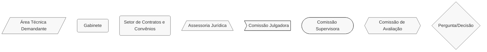

# 👥 Termo de Parceria (OSCIP)

## 💎 Dicas

| Item | Resposta  |
|------|-----------|
| **📢 Precisa de Seleção Pública?**                | Sim, obrigatória para seleção de OSCIPs, salvo exceções legais – art. 17 da Lei Estadual nº 23.081/2018 |
| **🤝 Tipos de parceiros**                         | • Organizações sociais civis de interesse público (OSCIPs) <br> • Órgãos públicos estaduais como intervenientes (compõem comissão de avaliação) |
| **💰 Envolve transferência de recursos?**         | Sim: financeiros e eventualmente patrimoniais, para execução do objeto da parceria, segundo metas, indicadores e programa de trabalho |
| **⏳ Vigência máxima**                            | 5 anos (com aditamentos), conforme art. 22, § 2º da [Lei Estadual nº 23.081/2018](https://www.almg.gov.br/legislacao-mineira/texto/LEI/23081/2018/?cons=1) |
| **🔒 Exige prestação de contas formal?**          | • Checagens amostrais e de efetividade (usualmente trimestrais) <br> • Relatórios gerenciais financeiro e de resultados (idem) <br> • Relatórios de monitoramento e avaliação (idem) <br> • Prestação de contas anual <br> • Prestação de contas sob demanda (cf. art. 63 do [Decreto Estadual nº 47.554/2018](https://www.almg.gov.br/legislacao-mineira/texto/DEC/47554/2018/?cons=1)) <br> • Apresentação de documentos: relatórios gerenciais, extratos bancários, parecer conselho fiscal/OS, balanços patrimoniais, entre outros <br> • Prestação de contas de extinção |
| **👮🏻 Exige gestor/fiscal designado?**            | • Supervisão formal: Comissão Supervisora e Comissão de Avaliação instituidas pelo IEPHA-MG e OSCIP (arts. 43, 46, 48, 49, 51, 52, 53 e 54 do [Decreto Estadual nº 47.554/2018](https://www.almg.gov.br/legislacao-mineira/texto/DEC/47554/2018/?cons=1)) <br> • Supervisor preside e acompanha execução, elabora parecer conclusivo e fiscaliza execução técnico-financeira |

---

## 📌 Definição
O **Termo de Parceria** é o instrumento firmado entre a administração pública estadual e a entidade qualificada como Organização da Sociedade Civil de Interesse Público (OSCIP) para fomento e execução de atividades relativas às áreas de interesse público, estabelecendo parceria com vistas à promoção da qualidade e eficiência na prestação dos serviços públicos (Lei Estadual nº 23.081/2018, art. 2º, IV; Decreto nº 47.554/2018, art. 29).

> **Você sabia?** As _áreas de interesse público_ do Modelo OSCIP estão definidas no art. 5º da [Lei Estadual nº 23.081/2018](https://www.almg.gov.br/legislacao-mineira/texto/LEI/23081/2018/?cons=1)

---

## 🏛️ Regulamentação
[Lei Estadual nº 23.081/2018](https://www.almg.gov.br/legislacao-mineira/texto/LEI/23081/2018/?cons=1) e [Decreto Estadual nº 47.554/2018](https://www.almg.gov.br/legislacao-mineira/texto/DEC/47554/2018/?cons=1).  
> Daqui em diante, utilizaremos "Lei" ou "Decreto" para citar essas normas.

---

## 🎯 Objetivos

- Fomentar e executar atividades de interesse público em parceria com o terceiro setor
- Promover qualidade e eficiência na prestação de serviços públicos
- Desenvolver mecanismos de integração entre setor público, sociedade e setor privado
- Fortalecer o controle social e a transparência nas políticas públicas

---

## 🛠️ Exemplos de aplicação no Iepha-MG

1. Projetos pontuais (com data de início e fim) de promoção, defesa e conservação do patrimônio histórico e artístico
2. Desenvolvimento de dossiês, estudos, pesquisas e produção de conhecimentos técnicos sobre patrimônio cultural
3. Ações educativas e de formação, relacionadas ao patrimônio cultural mineiro, de curto ou médio prazo
4. Aplicação de tecnologias e divulgação de informações sobre patrimônio cultural

--- 

## 📋 Regras

=== "✅ Pode"

    **Recursos podem ser usados para atender ao objeto do Termo de Parceria**:

    - Pagamento de equipes técnicas, administrativas e operacionais
    - Custeio e investimentos necessários à execução do objeto
    - Aquisição de materiais, equipamentos e serviços relacionados ao objeto
    - Contratação de obras, serviços e consultorias (com aprovação prévia)
    - Despesas de divulgação das ações
    - Outras despesas previstas na memória de cálculo aprovada

    **Facilidades administrativas:**

    - Autonomia na gestão dos recursos dentro do objeto pactuado
    - Remanejamento entre subcategorias de despesas (exceto pessoal)
    - Aplicação de rendimentos obtidos diretamente no objeto

=== "❌ Não pode"

    **⚠️ Proibições absolutas**:

    - Pagar multas, juros ou encargos (salvo por atraso do repasse estatal)
    - Usar recursos para finalidade diversa da pactuada
    - Realizar obras sem disposição expressa e autorização prévia
    - Contratação de consultorias ou assessorias externas não previstas e não aprovadas formalmente
    - Realizar despesas antes da aprovação do RCC pelo IEPHA e SEPLAG

    **⚠️ Exigências obrigatórias:**

    - Processo de seleção pública prévia (com exceções legais)
    - Qualificação prévia como OSCIP (dispensável para participação no processo de seleção)
    - Regularidade jurídica, fiscal e trabalhista
    - Aprovação de regulamentos próprios da OSCIP para contratações e compras
    - Designação da Comissão Supervisora e de Comissão de Avaliação

---

## 📢 Processo de seleção pública
Obrigatório para seleção de OSCIPs (art. 16 da Lei), salvo hipóteses de dispensa ou inviabilidade de competição (art. 17 da Lei).

=== "↔️ Fluxo Resumido do Termo de Parceria"

    ```mermaid
        %%{init: { 'flowchart': { 'htmlLabels': true }, 'maxTextSize': 90000 }}%%
        flowchart LR
        subgraph Publicacao["Publicação"]
            A1["Solicitar análise do estudo de viabilidade à Seplag (art. 15 da Lei e art. 8º do Decreto)"]
            A2["Elaborar edital e minuta de Termo de Parceria (art. 10 do Decreto)"]
            A3["Solicitar aprovação orçamentária do Cofin (art. 10, § 7º do Decreto)"]
            A4["Análise jurídica (art. 10, §6º do Decreto)"]
            A5["Constituir Comissão Julgadora (art. 15 do Decreto)"]
            A6["Publicar edital (mín. 10 dias úteis) (art. 10, §3º do Decreto)"]
            A1 --> A2 --> A3 --> A4 --> A5 --> A6
        end
        subgraph Julgamento
            B1["Julgar propostas (art. 18 do Decreto)"]
            B2["Publicar resultado (art. 19 do Decreto)"]
            B3["Recursos: 5 dias úteis (art. 19 do Decreto)"]
            B4["Homologar resultado final e convocar OSCIPs (art. 20 do Decreto)"]
            B1 --> B2 --> B3 --> B4
        end
        subgraph Celebracao["Celebração"]
            C1["Verificar documentos da OSCIP (art. 33 do Decreto)"]
            C2["Elaborar programa de trabalho e memória de cálculo (art. 30 e 31 do Decreto)"]
            C3["Obter manifestação (não vinculativa) do conselho de políticas públicas (art. 32 do Decreto)"]
            C4["Receber aprovação da Seplag e Cofin (art. 34 e 35 do Decreto)"]
            C5["Assinar Termo de Parceria e publicar extrato (art. 22, §1º da Lei)"]
            C1 --> C2 --> C3 --> C4 --> C5
        end
        Publicacao --> Julgamento --> Celebracao
        classDef default stroke:#333,stroke-width:1px,fill:#f8f8f8,rx:6,ry:6,font-size:15px;
    ```

=== "⏱️ Prazos relevantes"

    | Etapa                                                                                    | Prazo                                                | Base Legal               |
    |------------------------------------------------------------------------------------------|------------------------------------------------------|--------------------------|
    | Publicidade do edital                                                                    | 10 dias úteis (mínimo)                               | Art. 10, §3º do Decreto  |
    | Apresentação de propostas                                                                | 5 dias úteis (mínimo)                                | Art. 12, §1º do Decreto  |
    | Apresentação de recursos                                                                 | 5 dias úteis (mínimo)                                | Art. 19 do Decreto       |
    | Análise de recursos                                                                      | Até 5 dias úteis (prorrogável por igual período)     | Art. 19, §2º do Decreto  |
    | Publicação do Termo de Parceria e sua Memória de Cálculo (IEPHA-MG e OSCIP)              | Até 5 dias úteis após início da vigência             | Art. 35, §2º do Decreto  |
    | Realização de checagens amostrais e de efetividade (IEPHA-MG e OSCIP)                    | Trimestralmente (conforme Termo de Parceria)         | Art. 29, V do Decreto    |
    | Entrega de Relatórios de Resultados e Financeiro (OSCIP)                                 | Até 10 dias úteis após fim do período avaliatório    | Art. 48 do Decreto       |
    | Elaboração do Relatório de Monitoramento (Comissão Supervisora)                          | Trimestralmente (conforme Comissão Supervisora)      | Art. 49 do Decreto       |
    | Encaminhamento do Relatório de Monitoramento à Comissão de Avaliação (Comissão Supervisora) | 5 dias úteis antes da reunião da Comissão de Avaliação (mínimo) | Art. 52, § 5º do Decreto  |
    | Publicação de Relatórios de Resultados, Financeiro e de Monitoramento (IEPHA-MG e OSCIP) | Até 5 dias úteis após formalização de cada documento | Art. 50 do Decreto       |
    | Realização de Reunião de Avaliação (IEPHA-MG e OSCIP)                                    | Trimestralmente (data definida pelo supervisor)      | Art. 52, § 1º do Decreto |
    | Publicação de Relatório de Avaliação (IEPHA-MG e OSCIP)                                  | Até 5 dias úteis após formalização do documento      | Art. 53, § 2º do Decreto |
    | Prestação de contas (OSCIP)                                                              | Até 90 dias após competência/extinção                | Art. 62 do Decreto       |
    | Análise da prestação de contas (unidade de prestação de contas do IEPHA-MG)              | Até 40 dias úteis após o recebimento                 | Art. 65, §1º do Decreto  |
    | Elaboração de parecer conclusivo sobre prestação de contas (dirigente máximo)            | Até 10 dias úteis após o recebimento                 | Art. 67 do Decreto       |

## 📝 Programa de trabalho

**Deve conter:** (art. 30 do Decreto)

- Quadro e atributos dos indicadores com metas, prazos e descrições detalhadas
- Quadro e atributos dos produtos, quando necessário, com prazos e descrições
- Cronograma de Desembolsos
- Cronograma de Avaliações
- Quadro de pesos para avaliação

## 🔍 Monitoramento e avaliação

=== "👮🏻 Supervisor"

    O **Supervisor do Termo de Parceria** deve (art. 43, I do Decreto):

    - Presidir a Comissão Supervisora
    - Presidir a Comissão de Avaliação
    - Acompanhar e fiscalizar a execução
    - Analisar relatórios de resultados e relatórios financeiros elaborados e entregues pela OSCIP
    - Emitir relatórios de monitoramento
    - Informar irregularidades à Comissão de Monitoramento e a seu superior hierárquico

=== "🔍 Comissão Supervisora"

    A **Comissão Supervisora** deve (art. 43 do Decreto):

    - Ser composta por supervisor e supervisor adjunto
    - Monitorar a execução física e financeira do termo de parceria
    - Realizar checagens amostrais dos procedimentos de compras e contratações
    - Participar com poder de veto nas decisões da OSCIP relativas ao termo de parceria
    - Elaborar relatórios de checagem amostral e relatórios de monitoramento

=== "🎖️ Comissão de Avaliação"

    A **Comissão de Avaliação** deve (art. 32 da Lei e arts. 51 a 54 do Decreto):

    - Reunir-se trimestralmente, no mínimo
    - Ser integrada por representantes do IEPHA-MG, Órgão Estatal Interveniente (se houver), OSCIP, Seplag e Conselho de políticas públicas (frequentemente o CONEP, no caso do IEPHA-MG) e especialista da área
    - Analisar os resultados alcançados por meio dos relatórios de monitoramento
    - Elaborar relatórios de avaliação

## 🔒 Prestação de contas

=== "🗝️ Tipos"

    **Tipos de prestação de contas** (art. 63 do Decreto):

    1. **Prestação de contas anual**: apresentada até 90 dias após o fim do exercício
    2. **Prestação de contas de extinção**: apresentada até 90 dias após extinção do termo

=== "📋 Documentação"

    **Principais documentos exigidos** (art. 64 do Decreto):

    1. Relatório de execução do objeto com comprovação das metas alcançadas
    2. Relatórios gerenciais de resultados e financeiro
    3. Relatórios de Monitoramento, Avaliação e de Checagens Amostrais
    4. Extratos bancários de todas as contas vinculadas ao termo de parceria
    5. Parecer do conselho fiscal ou órgão equivalente da OSCIP
    6. Balanço patrimonial e demonstração de resultados do exercício

=== "🔬 Análise"

    **Análise da prestação de contas**:

    - A OSCIP deverá encaminhar ao OEP a prestação de contas anual em até 90 dias corridos após o término de cada exercício (art. 65 do Decreto)
    - A área de prestação de contas do IEPHA-MG deverá analisar e emitir parecer em até 40 dias úteis a partir do recebimento (art. 65, § 1º do Decreto)
    - Caso haja irregularidades, o IEPHA-MG deve notificar a OSCIP, que terá 15 dias úteis para justificar ou sanear irregularidades (art. 65, § 2º do Decreto)
    - Recebida a resposta da OSCIP, as áreas técnicas competentes e a área de prestação de contas deverão complementar o parecer em até 15 dias úteis (art. 65, § 3º do Decreto)
    - Então, o Supervisor do Termo de Parceria deverá elaborar um parecer conclusivo sobre a prestação de contas e o enviar ao dirigente máximo do IEPHA-MG (art. 66 do Decreto)
    - Finalmente, o Dirigente Máximo terá 10 dias úteis para aprovar as contas com ou sem ressalvas, ou reprovar as contas (art. 67 do Decreto)

===+ "🎯 Tabela sintética"

    | **Situação**                    | **Ato do Dirigente Máximo**       | **Resultado**               |
    |---------------------------------|-----------------------------------|-----------------------------|
    | Regular execução do Termo de Parceria   | Aprovação sem ressalvas (art. 67, I do Decreto)           | Publicação da Aprovação (art. 67, §2º do Decreto) |
    |  Irregularidade ou invalidade de natureza formal que não resulte em dano ao erário    | Aprovação com ressalvas (art. 67, II do Decreto)  | Publicação da Aprovação ou, em caso de irregularidades graves ou insanáveis, Representação ao Tribunal de Contas do Estado de Minas Gerais (art. 67, §1º do Decreto) |
    | Dano ao erário ou a falta de comprovação total ou parcial da aplicação de recursos do contrato de gestão             | Reprovação das contas (art. 67, III, do Decreto)  | Instaurar PACE-Parcerias (art. 67, §3º do Decreto) |

## 🔍 Saiba mais!
Modelos e minutas do Estado podem ser encontrados em uma página especial do [Portal da Seplag](https://www.mg.gov.br/planejamento/pagina/planejamento-e-orcamento/parcerias-com-oscip/oscip) e em nossa [Biblioteca](../../biblioteca/index.md).

- [Modelo de qualificação como OSCIP](https://www.mg.gov.br/planejamento/documento/modelo-de-requerimento-de-qualificacaorenovacao-como-oscip)
- [Modelo de solicitação de estudo de viabilidade](https://www.mg.gov.br/planejamento/documento/modelo-de-solicitacao-de-estudo-de-viabilidade)
- [Modelo de edital de processo de seleção pública](https://www.mg.gov.br/planejamento/documento/maio_25-modelo-de-edital-processo-de-selecao-publica-oscip_vr9docx)
- [Modelo de minuta de Termo de Parceria](https://www.mg.gov.br/planejamento/documento/modelo-de-minuta-de-termo-de-parceria)
- [Modelo de memória de cálculo](https://www.mg.gov.br/planejamento/documento/modelo-de-memoria-de-calculo-0)
- [Modelo de relatório de resultados](https://www.mg.gov.br/planejamento/documento/modelo-de-relatorio-de-resultados)
- [Modelo de relatório financeiro](https://www.mg.gov.br/planejamento/documento/modelo-de-relatorio-financeiro)
- [Modelo de relatório de checagem amostral](http://www.planejamento.mg.gov.br/documento/modelo-de-relatorio-de-checagem-amostral-0)
- [Modelo de relatório de checagem de efetividade](http://www.planejamento.mg.gov.br/documento/modelo-de-relatorio-de-checagem-de-efetividade-0)
- [Modelo de relatório de monitoramento](https://www.mg.gov.br/planejamento/documento/modelo-de-relatorio-de-monitoramento)
- [Modelo de relatório de avaliação](https://www.mg.gov.br/planejamento/documento/jan_25-modelo-de-relatorio-da-comissao-de-avaliacao_20docx-1)
- [Manual SEPLAG de orientações sobre as rotinas de monitoramento e fiscalização](https://www.mg.gov.br/system/files/media/documento_detalhado/2025-07/Manual%20de%20orienta%C3%A7%C3%B5es%20para%20a%20comiss%C3%A3o%20supervisora_2025.pdf)
- [Página sobre o Termo de Parceria nº 53/2023 - Fundação Clóvis Salgado e Associação Pró Cultura e Promoção das Artes  - APPA](https://fcs.mg.gov.br/contrato-de-gestao-termo-de-parceria), atualmente vigente

## ↔️ Fluxograma completo para celebração, execução e prestação de contas do Termo de Parceria

```mermaid
%%{init: { 'flowchart': { 'htmlLabels': true, 'wrappingWidth': 180 }, 'maxTextSize': 90000 }}%%
flowchart TD
    %% Etapas iniciais
    A@{ shape: lean-r, label: "Solicitar Termo de Parceria" } --> B@{ shape: rect, label: "Solicitar análise do estudo de viabilidade à Seplag (art. 15 da Lei e art. 8º do Decreto) e aprovação orçamentária do Cofin (art. 10, § 7º do Decreto)" }
    B --> C@{ shape: diamond, label: "Manifestação favorável da Seplag?" }
    C -->|Não| RES((("Fim")))
    C -->|Sim| D@{ shape: diamond, label: "Necessita processo de seleção pública? (art. 17 da Lei)" }
    D -->|Sim| sel
    D -->|Não| dis
    %% Processo de Seleção Pública
    subgraph sel ["Processo de Seleção Pública"]
        E1@{ shape: lean-r, label: "Elaborar edital e minuta do Termo de Parceria (art. 10 do Decreto)" }
        E1 --> E2@{ shape: diamond, label: "Minutas validadas?" }
        E2 -->|Não| E1
        E2 -->|Sim| E3@{ shape: rect, label: "Encaminhar processo ao setor de Contratos e Convênios" }
        E3 --> E4@{ shape: rounded, label: "Instruir processo no SEI" }
        E4 --> E5@{ shape: trap-b, label: "Análise jurídica obrigatória (art. 10, §6º do Decreto)" }
        E5 --> E6@{ shape: rounded, label: "Promover ajustes e anexar nota saneadora" }
        E6 --> E7@{ shape: rounded, label: "Constituir Comissão Julgadora (art. 15 do Decreto)" }
        E7 --> E8@{ shape: rect, label: "Publicar edital (mín. 15 dias úteis) (Art. 10, §3º e Art. 12, §1º do Decreto)" }
        E8 --> E9@{ shape: odd, label: "Receber propostas das OSCIPs (art. 17 e 18 do Decreto)" }
        E9 --> E10@{ shape: odd, label: "Julgamento das propostas (art. 18 do Decreto)" }
        E10 --> E11@{ shape: rounded, label: "Publicação do resultado (art. 19 do Decreto)" }
        E11 --> E12@{ shape: odd, label: "Recursos: 5 dias úteis (art. 19 do Decreto)" }
        E12 --> E13@{ shape: rounded, label: "Homologação do resultado final (art. 20 do Decreto)" }
        E13 --> E14@{ shape: rect, label: "Convocar entidade vencedora ou segunda colocada (art. 20, §§ 1º e 2º do Decreto)" }
    end
    %% Dispensa
    subgraph dis ["Dispensa/Inexigibilidade"]
        F1@{ shape: rect, label: "Instruir justificativa de dispensa (art. 17 da Lei e art. 22 do Decreto)" }
        F1 --> F2@{ shape: rect, label: "Desenvolver minuta do Termo de Parceria (art. 25 do Decreto)" }
        F2 --> F3@{ shape: diamond, label: "Minutas validadas?" }
        F3 -->|Não| F2
        F3 -->|Sim| F4@{ shape: rect, label: "Encaminhar processo ao setor de Contratos e Convênios" }
        F4 --> F5@{ shape: rounded, label: "Instruir processo no SEI" }
        F5 --> F6@{ shape: trap-b, label: "Análise jurídica obrigatória (art. 22, XIV do Decreto)" }
        F6 --> F7@{ shape: rounded, label: "Promover ajustes e anexar nota saneadora" }
        F7 --> F8@{ shape: rounded, label: "Publicar extrato de dispensa (art. 22, parágrafo único do Decreto)" }
        F8 --> F9@{ shape: rect, label: "Receber e analisar eventuais impugnações: 5 dias úteis (art. 24 do Decreto)" }
    end
    %% Elaboração do programa de trabalho - comum para ambos fluxos
    E14 --> G1@{ shape: rect, label: "Elaborar programa de trabalho, memória de cálculo (arts. 30 e 31 do Decreto) e Regulamento de Compras e Contratações (art. 36 do Decreto)" }
    F9 --> G1
    %% Celebração
    G1 --> H1@{ shape: rounded, label: "Providenciar manifestação (não vinculativa) do conselho de políticas públicas (art. 32 do Decreto)" }
    H1 --> Z11@{ shape: trap-b, label: "Análise jurídica obrigatória (art. 33, VIII do Decreto)" }
    Z11 --> Z12@{ shape: rounded, label: "Promover ajustes e anexar nota saneadora" }
    Z12 --> I1@{ shape: rounded, label: "Instruir o processo no SEI (art. 33 do Decreto)" }
    I1 --> J1@{ shape: rounded, label: "Providenciar aprovação da Seplag e Cofin (arts. 34 e 35 do Decreto)" }
    J1 --> K1@{ shape: rect, label: "Instituir Comissão Supervisora (art. 43 do Decreto)" }
    K1 --> K2@{ shape: rect, label: "Assinar Termo de Parceria e publicar extrato (art. 22, §1º da Lei)" }
    K2 --> K3@{ shape: rect, label: "Instituir Comissão de Avaliação (art. 51 do Decreto)" }
    K3 --> L1@{ shape: stadium, label: "Realizar trimestralmente checagens amostrais e de efetividade (art. 46 do Decreto)" }
    L1 --> Z9@{ shape: stadium, label: "Receber trimestralmente Relatórios de Resultados e Financeiro da OSCIP (art. 48 do Decreto)" }
    Z9 --> L2@{ shape: stadium, label: "Elaborar trimestralmente Relatório de Monitoramento (art. 50 do Decreto)" }
    L2 --> L3@{ shape: stadium, label: "Publicar Relatório de Resultados e Realtório de Monitoramento no site do IEPHA-MG (art. 50 do Decreto" }
    L3 --> Z1@{ shape: stadium, label: "Encaminhar Relatório de Monitoramento para Comissão de Avaliação, 5 dias úteis antes da reunião (art. 52, § 5º do Decreto)" }
    Z1 --> M1@{ shape: hex, label: "Realizar trimestralmente reunião da Comissão de Avaliação (arts. 52 e 53 do Decreto)" }
    M1 --> M2@{ shape: hex, label: "Publicar Relatório de Avaliação (art. 53 do Decreto)" }
    M2 --> N1@{ shape: diamond, label: "Metas atingidas?" }
    N1 -->|Sim| O1@{ shape: rounded, label: "Receber prestação de contas em até 90 dias após fim do ano (art. 65 do Decreto)" }
    N1 -->|Não| N2@{ shape: diamond, label: "Há justificativa formal e coerente? (art. 71, V do Decreto)" }
    N2 -->|Sim| O1
    N2 -->|Não| P1@{ shape: rect, label: "Instaurar processo administrativo (art. 71, §§ 3º, 4º e 5º do Decreto)" }
    P1 --> P2@{ shape: diamond, label: "Processo administrativo recomenda rescisão unilateral do Contrato de Gestão? (art. 71, § 2º do Decreto)" }
    P2 -->|Não| O1
    P2 -->|Sim| P3@{ shape: rect, label: "Rescindir o Termo de Parceria unilateralmente (art. 71 do Decreto) e verificar hipótese de continuidade do serviço público (art. 72 do Decreto)" }
    P3 --> RES
    %% Prestação de contas
    O1 --> Q1@{ shape: rounded, label: "Emitir parecer em até 40 dias úteis (art. 65, §1º do Decreto)" } 
    Q1 --> Q2@{ shape: diamond, label: "Há irregularidades?" }
    Q2 -->|Não| Q3@{ shape: stadium, label: "Supervisor: elaborar parecer conclusivo e encaminhar para o dirigente máximo (art. 66 do Decreto)" }
    Q2 -->|Sim| Q4@{ shape: rounded, label: "Notificar OSCIP para apresentação de justificativa ou saneamento das irregularidades em até 15 dias úteis (art. 65, §2º do Decreto)" }
    Q4 --> Q5@{ shape: rounded, label: "Analisar saneamento em até 15 dias úteis e encaminhar novo parecer (art. 65, §3º do Decreto)" }
    Q5 --> Q3
    %% Decisão conclusiva
    Q3 --> R1@{ shape: rect, label: "Dirigente máximo: aprovar ou reprovar as contas (art. 67 do Decreto)" }
    R1 --> R2@{ shape: diamond, label: "Contas aprovadas?" }
    R2 -->|Sim| RES
    R2 -->|Ressalvas| R3@{ shape: rect, label: "Promover representação ao TCEMG (art. 67, § 2º do Decreto)" }
    R3 --> RES
    R2 -->|Reprovação| R4@{ shape: rect, label: "Iniciar PACE-Parcerias (art. 67, § 3º do Decreto)" }
    R4 --> RES
    classDef default stroke:#333,stroke-width:1px,fill:#f8f8f8,rx:6,ry:6,font-size:15px;
```



