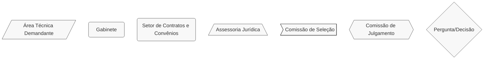

# 🎓 Termo de Bolsa Cultural (TBC)

## 💎 Dicas

| Item | Resposta |
|------|----------|
| **📢 Precisa de Seleção Pública?** | Sim, salvo situações excepcionais - art. 6º, § 2º da [Lei Federal nº 14.903/2024](https://www.planalto.gov.br/ccivil_03/_ato2023-2026/2024/lei/l14903.htm). Essas situações ainda não foram regulamentadas por decreto |
| **🤝 Tipos de parceiros** | • Pesquisadores, estudantes, professores e alunos <br> • Agentes culturais interessados em participar em eventos como feiras, mercados, festivais e rodadas de negócios no Brasil ou no exterior <br> • Artistas, coletivos, MEIs ou PJs com projetos de circulação estadual cultural <br> • Agentes culturais interessados em capacitação profissional ou acadêmica <br> Entidades ou pessoas físicas com projetos de promoção, memória, patrimônio cultural, difusão e capacitação na área de cultura |
| **💰 Envolve transferência de recursos?** | Sim: apoio financeiro (doação com encargo) para cumprimento de encargo específico (ação cultural, pesquisa, capacitação etc.) |
| **⏳ Vigência máxima** | Não: definida pelo encargo específico (cursos, eventos, residências artísticas etc.), sem prazo máximo explícito na lei |
| **🔒 Exige prestação de contas formal?** | • Relatório de Bolsista simplificado comprovando cumprimento do encargo (art. 25) <br> • Documentos: diplomas, certificados, relatórios, fotos, comprovantes de matrícula, produtos culturais etc. <br> • Vedada exigência de demonstração financeira detalhada (art. 25) <br> • Sanções por descumprimento em até 6 meses após vigência (art. 25, § 1º): multa, suspensão da possibilidade de celebrar instrumentos no Marco do Fomento (180-540 dias), ações compensatórias |
| **👮🏻 Exige gestor/fiscal designado?** | Sim: agente público designado para essa finalidade pela autoridade competente (art. 32), mas sua incumbência se resume à verificação do cumprimento do encargo analisando o Relatório de Bolsista, sem análise financeira |

---

## 📌 Definição:

O **Termo de Bolsa Cultural** é o instrumento jurídico para apoio financeiro a agente cultural com interesse em processo de formação, qualificação, especialização, intercâmbio, pesquisa, criação em âmbito artístico e cultural, além de circulação de espetáculos e obras e outras ações de promoção, memória, patrimônio cultural e congêneres, mediante cumprimento de encargo específico.

> **Importante!** Cumprir um "_encargo_" significa entregar um produto, relatório ou realizar uma ação definida, como por exemplo concluir um curso, realizar apresentações de circulação de um espetáculo, ou finalizar uma disciplina com, no mínimo, determinada nota. O termo é comum em bolsas estudantis e, agora, se aplica também às bolsas culturais.

---

## 🏛️ Regulamentação:
Subseção III - Do Termo de Bolsa Cultural - da Seção III - Dos Procedimentos por Instrumento - da [Lei Federal nº 14.903/2024](https://www.planalto.gov.br/ccivil_03/_ato2023-2026/2024/lei/l14903.htm) (Marco do Fomento).

---

## 🎯 Objetivos

- Promover formação e qualificação de agentes culturais
- Viabilizar intercâmbios e residências artísticas
- Apoiar processos de pesquisa e criação cultural
- Democratizar acesso a oportunidades de capacitação
- Estimular a circulação e intercâmbio cultural nacional e internacional

---

## 🛠️ Exemplos de aplicação no Iepha-MG

1. Bolsas de especialização em conservação e restauro
2. Intercâmbios para capacitação em gestão de patrimônio cultural
3. Participação em eventos estratégicos (congressos, feiras de patrimônio)
4. Residências artísticas para artesãos tradicionais
5. Cursos de capacitação em educação patrimonial
6. Pesquisas sobre técnicas tradicionais de construção mineira
7. Formação em digitalização e catalogação de acervos

---

## 📋 Regras

=== "✅ Pode"

    **Recursos podem ser usados para atender ao objeto do Termo de Bolsa Cultural:**

    - Participação em eventos estratégicos nacionais e internacionais (feiras, mercados, festivais, rodadas de negócios)
    - Intercâmbios, residências artísticas, técnicas ou de gestão cultural
    - Projetos de pesquisa para criação de obras e espetáculos artísticos
    - Cursos de capacitação profissional, extensão, graduação, especialização, mestrado ou doutorado
    - Ações de circulação em qualquer território (estadual, nacional ou internacional)
    - Outras atividades de promoção, memória, preservação do patrimônio cultural, difusão e capacitação cultural
    
    **Facilidades administrativas:**

    - Não exige demonstração financeira (art. 24)
    - Prestação de contas simplificada: apenas relatório do bolsista sobre cumprimento do encargo
    
=== "❌ Não pode"

    ⚠️ **Proibições absolutas:**

    - Celebrar apoio sem chamamento público prévio (exceto excepcionalidades do art. 6º, §2º, ainda não regulamentadas)
    - Exigir dos agentes culturais contrapartida financeira, em bens ou serviços (art. 6º, §3º)
    - Aceitar propostas com conteúdo preconceituoso ou discriminatório (art. 9º, §5º)
    - Solicitar demonstração financeira detalhada (art. 24)

    ⚠️ **Exigências obrigatórias:**

    - Chamamento público para seleção dos beneficiários
    - Definição clara do encargo no edital
    
---

## 📢 Chamamento público

Em regra, é obrigatória a realização de chamamento público prévio. Até que sejam publicadas as normas sobre as exceções, recomenda-se sempre adotar o chamamento público.

=== "↔️ Fluxo Resumido do Chamamento Público"

    ```mermaid
        %%{init: { 'flowchart': { 'htmlLabels': true }, 'maxTextSize': 90000 }}%%
            flowchart LR
                subgraph Planejamento
                    A1["Consulta pública e reuniões técnicas"]
                    A2["Proposição técnica da minuta de edital"]
                    A3["Verificação formal: parecer jurídico só se não for utilizada minuta padrão (art. 8º, § 3º)"]
                    A4["Publicação do edital"]

                    A1 --> A2 --> A3 --> A4
                end
                subgraph Processamento
                    B1["Recebimento das propostas (mínimo de 5 dias úteis conforme art. 9º, I)"]
                    B2["Análise pela comissão de seleção"]
                    B3["Resultado provisório e prazos de recursos (3 dias úteis art. 9º, III) / contrarrazões (2 dias úteis art. 9º, III)"]
                    B4["Recebimento e julgamento dos recursos"]
                    B5["Publicação do resultado final"]

                    B1 --> B2 --> B3 --> B4 --> B5
                end
                subgraph Celebração
                    C1["Habilitação dos agentes culturais (após seleção: art. 10, § 1º)"]
                    C2["Convocação de novos agentes (em caso de inabilitação)"]
                    C3["Assinatura dos Termos de Bolsa Cultural"]

                    C1 --> C2 --> C3
                end
                Planejamento --> Processamento --> Celebração

        classDef default stroke:#333,stroke-width:1px,fill:#f8f8f8,rx:6,ry:6,font-size:15px;

    ```

=== "⏱️ Prazos relevantes"

    | Etapa | Prazo | Base Legal |
    |-------|-------|------------|
    | Publicidade do edital      | NA                | NA         |
    | Inscrição de propostas | 5 dias úteis (mínimo) | Art. 9º, I da Lei |
    | Análise de propostas   | NA                    | NA         |
    | Apresentação de recursos | 3 dias úteis (mínimo) | Art. 9º, III da Lei |
    | Análise de recursos | NA | NA |
    | Apresentação de contrarrazões (se houver) | 2 dias úteis (mínimo) | Art. 9º, III da Lei |
    | Análise de contrarrazões | NA | NA |
    | Publicação do resultado final | NA | NA |
    | Convocação dos selecionados e habilidação | NA | NA |
    | Apresentação de recursos de habilitação (se houver inabilitação) | 3 dias úteis (máximo) | Art. 10, § 10 da Lei |
    | Relatório de Bolsista (apresentação pelo agente cultural, ao término do cumprimento do encargo) | NA | NA |
    | Análise do Relatório de Bolsista e eventual publicação de sanção ao agente cultural no caso de não cumprimento do encargo | Até 6 meses após fim da vigência do Termo de Bolsa Cultural | Art. 25, § 2º |

=== "🔑 Regras-Chave"

    - No Marco Regulatório do Fomento à Cultura, os chamamentos públicos podem ser (art. 6º, I e II):
    - **De fluxo contínuo**: nos casos em que for possível a celebração de Termos de Bolsa Cultural à medida que as propostas são recebidas
    - **De fluxo ordinário**: nos casos em que a Administração Pública optar pela concentração do recebimento, da análise e da seleção de propostas em período determinado
    - É indispensável fazer consulta pública ou processo equivalente antes de publicar o edital (art. 8º, § 1º)
    - Nem sempre é necessária uma nova análise jurídica do edital ou do Termo de Bolsa: quando utilizada minuta padronizada (que já foi analisada pelo jurídico de um órgão público), a **autoridade responsável pela publicação do edital** (geralmente dirigente máximo do órgão público) pode assumir a _verificação de adequação formal da minuta de edital_ (art. 8º, § 3º)
    - Seleção de propostas pode ser feita por voluntários credenciados ou pareceristas contratados (art. 9º, § 3º) 
    - Fase de habilitação somente após seleção de propostas (art. 10, § 1º)
    - Cadastros prévios (como o Descentra Cultura) são aceitos (art. 9º, § 2º e art. 10, § 4º)
    - Inscrições orais e busca ativa de propostas são opções para propostas de agentes culturais de grupos vulneráveis (art. 8º, § 6º)

---

## 🎯 Natureza da bolsa

Uma boa bolsa cultural deve prever:

- **Especificidade:** definir claramente qual atividade formativa/qualificadora deve ser realizada
- **Mensurabilidade:** permitir verificação objetiva do cumprimento (certificados, relatórios, produtos, diplomas, matrículas)
- **Adequação:** alinhar-se aos objetivos da política pública de fomento cultural
- **Viabilidade:** ser factível dentro do prazo e recursos disponibilizados
- **Relevância:** contribuir efetivamente para a formação do agente cultural

---

## 👀 Monitoramento e controle

O TBC prevê que a autoridade competente (dirigente do órgão) designe **um agente público** para executar rotinas e atividades de monitoramento e de controle da implementação da bolsa concedida (art. 32).

Não é necessário mais que um agente, embora este possa contar com apoio técnico de outras áreas de seu órgão, bem como serviços contratados com terceiros ou decorrentes da celebração de parcerias.

Entretanto, as rotinas e atividades de monitoramento são relativamente simples, se circunscrevendo à verificação do cumprimento do encargo contraído pelo agente cultural que assinou o TBC.

O agente público deve fazer isso analisando o Relatório de Bolsista apresentado pelo agente cultural ao fim da vigência do TBC, **sem precisar fazer qualquer análise financeira** (art. 25 da Lei). O agente público também pode solicitar ao agente cultural, a qualquer tempo, informações sobre o cumprimento do objeto do TBC.

---

## 🔒 Prestação de contas

=== "📋 Documentos"

    Apresentação de **Relatório de Bolsista**, com foco no cumprimento do encargo, sendo **vedada a exigência de demonstração financeira** (Art. 25). O Relatório do Bolsista poderá conter:

    - Diplomas ou certificados obtidos
    - Relatório escrito das atividades
    - Fotografias comprovando as atividades
    - Comprovantes de matrícula
    - Declarações de conclusão de curso ou documentos parecidos
    - Produtos culturais resultantes da formação
    - Borderô comprovando circulação de espetáculos ou obras
    - Clipping ou publicações resultantes da ação cultural
    - Outros documentos adequados à natureza da atividade

=== "💣 Em caso de não cumprimento"

    Se **não houver cumprimento do encargo**, o processo será encaminhado à autoridade responsável (art. 25, § 1º), que poderá determinar:

    - **Pagamento de multa**, conforme definido no Termo de Bolsa Cultural (e/ou regulamento por decreto), com atualização e juros conforme art. 25, § 5º do Marco do Fomento
    - **Suspensão da possibilidade de celebrar** instrumento no Marco do Fomento pelo prazo de 180 a 540 dias

    Essa decisão deve ser proferida em até 6 meses após o fim da vigência do Termo de Bolsa Cultural (art. 25, § 2º) e a ocorrência de caso fortuito ou força maior impeditiva da execução do encargo afasta a possibilidade de aplicar essas medidas (art. 25, § 3º).
    
    Além disso, as sanções podem ser convertidas em ações compensatórias (art. 25, § 4º).

===+ "🎯 Tabela sintética"
    | **Situação**                    | **Ato da Autoridade Responsável**       | **Resultado**               |
    |---------------------------------|-----------------------------------|-----------------------------|
    | Cumprimento do encargo mediante apresentação de Relatório de Bolsista (art. 25)   | Aprovação do relatório           | Encerramento regular do Termo de Bolsa Cultural |
    | Não cumprimento do encargo (art. 25, §1º)    | Decisão no prazo de 6 meses após o fim da vigência (art. 25, §2º)  | • Pagamento de multa <br> • E/ou Suspensão de celebração de instrumento no Marco do Fomento por 180 a 540 dias |
    | Caso fortuito ou força maior impeditiva da execução do encargo (art. 25, §3º)             | Reconhecimento da excludente  | Afastamento das sanções previstas (multa e suspensão) |
    | Aplicação de sanções (art. 25, §4º)             | Conversão em ações compensatórias  | Substituição da multa ou suspensão por medidas alternativas pactuadas via Plano de Ações Compensatórias  |

---

## 🔍 Saiba mais!

Modelos e documentos de referência (editais, termos, relatórios etc.) podem ser encontrados no nossa [Biblioteca](../../biblioteca/index.md). 

- [Minuta de Edital Padrão para Bolsas Culturais de Pesquisa (PNAB)](https://www.gov.br/cultura/pt-br/assuntos/politica-nacional-aldir-blanc/modelos-de-editais/modelos-para-bolsas-de-pesquisa-pnab/edital-bolsas-de-pesquisa)
- [Anexo 01 - Categorias](https://www.gov.br/cultura/pt-br/assuntos/politica-nacional-aldir-blanc/modelos-de-editais/modelos-para-bolsas-de-pesquisa-pnab/anexo-i-bolsa-de-pesquisa.docx)
- [Anexo 02 - Formulário de inscrição](https://www.gov.br/cultura/pt-br/assuntos/politica-nacional-aldir-blanc/modelos-de-editais/modelos-para-bolsas-de-pesquisa-pnab/anexo-ii-formulario-de-inscricao-pesquisas.docx)
- [Anexo 03 - Critérios de avaliação e seleção de projetos de pesquisa](https://www.gov.br/cultura/pt-br/assuntos/politica-nacional-aldir-blanc/modelos-de-editais/modelos-de-editais-demais-bolsas/anexo-iii-criterios-de-avaliacao-e-selecao-de-projetos.docx)
- [Anexo 04 - Termo de Bolsa Cultural](https://www.gov.br/cultura/pt-br/assuntos/politica-nacional-aldir-blanc/modelos-de-editais/modelos-para-bolsas-de-pesquisa-pnab/anexo-iv-termo-de-bolsa-cultural)
- [Anexo 05 - Relatório do Bolsista](https://www.gov.br/cultura/pt-br/assuntos/politica-nacional-aldir-blanc/modelos-de-editais/modelos-para-bolsas-de-pesquisa-pnab/anexo-v-relatorio-do-bolsista-pesquisa.docx)
- [Anexo 06 - Declaração Étnico-racial - Bolsas](https://www.gov.br/cultura/pt-br/assuntos/politica-nacional-aldir-blanc/politica-nacional-aldir-blanc/copy_of_Anexo06DeclaraotnicoracialPremiaoAtualizadoem02.06.2025.docx)
- [Anexo 07 - Declaração PCDs](https://www.gov.br/cultura/pt-br/assuntos/politica-nacional-aldir-blanc/politica-nacional-aldir-blanc/copy_of_Anexo07DeclaraoPCDsAtualizadoem02.06.2025.docx)
- [Anexo 09 - Formulário de recurso](https://www.gov.br/cultura/pt-br/assuntos/politica-nacional-aldir-blanc/politica-nacional-aldir-blanc/Anexo09FormulriodeRecursoBolsaCulturaldePesquisaAtualizadoem02.06.2025.docx)

---

## 🔄️ Fluxograma

Todos os procedimentos do fluxograma referem-se ao [Marco do Fomento - Lei Federal  nº 14.903/2024](https://www.planalto.gov.br/ccivil_03/_ato2023-2026/2024/lei/l14903.htm). Diferentes formatos das caixinhas significam diferentes setores responsáveis por cada atividade, conforme legenda.

```mermaid
%%{init: { 'flowchart': { 'htmlLabels': true, 'wrappingWidth': 180 }, 'maxTextSize': 90000 }}%%
flowchart TD
%% Etapas iniciais
A@{ shape: lean-r, label: "Solicitar parceria" } --> B@{ shape: rect, label: "Analisar solicitação" }
B --> C@{ shape: diamond, label: "Bolsa é viável?" }
C -->|Não| D@{ shape: rect, label: "Informar e justificar negativa à área técnica por e-mail" }
D --> RES((("Fim")))
C -->|Sim| E@{ shape: diamond, label: "Necessita Chamamento Público? (art. 6º, § 2º)" }
E -->|Sim| cham
E -->|"Não (verificar regulamentação por decreto)"| disp

%% Chamamento Público
subgraph cham ["Chamamento Público"]
    F1@{ shape: lean-r, label: "Desenvolver/revisar minuta de edital de chamamento público e Termo de Bolsa" } --> F2@{ shape: diamond, label: "Minutas validadas?" }
    F2 -->|Não| F1
    F2 -->|Sim| F3@{ shape: rect, label: "Encaminhar processo ao setor de Contratos e Convênios" }
    F3 --> F4@{ shape: rounded, label: "Instruir processo no SEI" }
    F4 --> F5@{ shape: rounded, label: "Realizar consulta pública ou processo equivalente (art. 8º, § 1º)" }
    F5 --> F6@{ shape: rect, label: "Revisar edital conforme consulta pública" }
    F6 --> F7@{ shape: diamond, label: "Passará por análise jurídica? (art. 8º, § 3º)" }
    F7 -->|Sim| F8@{ shape: trap-b, label: "Análise Jurídica" }
    F8 --> F9@{ shape: rounded, label: "Promover ajustes e anexar nota saneadora" }
    F7 -->|Não| F10@{ shape: rect, label: "Providenciar parecer da autoridade competente pela publicação do edital" }
    F9 --> F10
    F10 --> F11@{ shape: rect, label: "Assinar e publicar edital com definição clara do encargo" }
    F11 --> F12@{ shape: odd, label: "Receber propostas (mínimo de 5 dias úteis: art. 9º, I)" }
    F12 --> F13@{ shape: odd, label: "Analisar propostas" }
    F13 --> F14@{ shape: rounded, label: "Publicar resultado provisório e aguardar prazo para recursos (3 dias úteis: art. 9º, III)" }
    F14 --> F15@{ shape: hex, label: "Receber, analisar e julgar recursos" }
    F15 --> F16@{ shape: diamond, label: "Recursos alteraram classificação?" }
    F16 -->|Sim| F17@{ shape: hex, label: "Receber e analisar contrarrazões (2 dias úteis: art. 9º, III)" }
    F17 --> F18@{ shape: rounded, label: "Publicar resultado final" }
    F16 -->|Não| F18
end

%% Dispensa de Chamamento
subgraph disp ["Dispensa de Chamamento"]
    G1@{ shape: lean-r, label: "Elaborar parecer técnico justificando dispensa de chamamento" } --> G2@{ shape: lean-r, label: "Desenvolver/revisar minuta de Termo de Bolsa" }
    G2 --> G3@{ shape: diamond, label: "Minutas validadas?" }
    G3 -->|Não| G2
    G3 -->|Sim| G4@{ shape: rect, label: "Encaminhar processo ao setor de Contratos e Convênios" }
    G4 --> G5@{ shape: rounded, label: "Instruir processo no SEI" }
    G5 --> G6@{ shape: trap-b, label: "Análise Jurídica (se aplicável)" }
    G6 --> G7@{ shape: rounded, label: "Promover ajustes e anexar nota saneadora" }
end

%% Habilitação e assinatura - comum para ambos fluxos
F18 --> H1@{ shape: rounded, label: "Habilitar agentes culturais selecionados" }
G7 --> H1
H1 --> H2@{ shape: diamond, label: "Houve inabilitação?" }
H2 -->|Sim| H3@{ shape: rounded, label: "Convocar e habilitar novos agentes" }
H3 --> H4@{ shape: rounded, label: "Assinar Termo de Bolsa Cultural" }
H2 -->|Não| H4

%% Execução e prestação de contas
H4 --> I1@{ shape: rounded, label: "Transferir recursos (doação com encargo)" }
I1 --> I2@{ shape: lean-r, label: "Executar ação cultural" }
I2 --> I3@{ shape: lean-r, label: "Apresentar Relatório de Bolsista comprovando cumprimento do encargo" }
I3 --> I4@{ shape: diamond, label: "Encargo foi cumprido?" }
I4 -->|Sim| RES((("Fim")))
I4 -->|Não| I5@{ shape: rounded, label: "Aplicar sanções: multa ou suspensão (art. 25, § 1º) ou converter em ações compensatórias" }
I5 --> RES

classDef default stroke:#333,stroke-width:1px,fill:#f8f8f8,rx:6,ry:6,font-size:15px;

```




