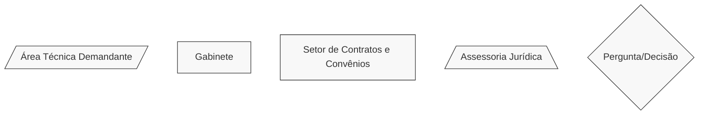

# 🤝 Termo de Cooperação Cultural (TCC)

## 💎 Dicas

| Item | Resposta |
|------|----------|
| **📢 Precisa de Chamamento Público?** | Não: art. 6º, § 1º e art. 30 da [Lei Federal nº 14.903/2024](https://www.planalto.gov.br/ccivil_03/_ato2023-2026/2024/lei/l14903.htm). Apesar disso, a administração pode fazer chamamento, se quiser |
| **🤝 Tipos de parceiros** | • Instituições de ensino e pesquisa   • Universidades e centros de pesquisa   • Museus e centros culturais   • Organizações da sociedade civil voltadas à cultura   • Agentes culturais com expertise técnica específica   • Entidades culturais com capacidade operacional para cooperação   • Artistas e coletivos culturais   • Empresas da área cultural   • Entidades ou empresas interessadas em executar projetos culturais |
| **💰 Envolve transferência de recursos?** | Não: instrumento baseado em mútua colaboração sem repasse de recursos públicos (art. 29) |
| **⏳ Vigência máxima** | Não há prazo máximo explícito na lei. Vigência deve ser definida conforme objeto e necessidades da cooperação |
| **🔒 Exige prestação de contas formal?** | Não exige prestação de contas (art. 30, § 1º)   • Exceção: se houver plano de trabalho por *significativa complexidade do objeto*, apresenta-se Relatório de Cooperação Cultural para comprovar cumprimento dos compromissos previstos no TCC (art. 30, § 1º)   • Conteúdo do relatório: descrição de atividades, resultados, benefícios mútuos, produtos desenvolvidos   • Vedada exigência de comprovação financeira (art. 30, § 1º) |
| **👮🏻 Exige gestor/fiscal designado?** | Sim: agente público designado para acompanhamento da cooperação e verificação do cumprimento das obrigações acordadas (art. 32), mas sua incumbência se resume à verificação do cumprimento dos compromissos assumidos e do plano de trabalho (se houver) |
| **🛣️ Plano de trabalho obrigatório?** | Não. Somente se utiliza plano de trabalho quando o objeto possuir *significativa complexidade* (art. 29, parágrafo único), conforme análise do caso concreto |

---

## 📌 Definição

O **Termo de Cooperação Cultural*** (TCC) é o instrumento jurídico por meio do qual a administração pública estabelece com o agente cultural uma relação de mútua colaboração que visa a promover ações de interesse recíproco (cujo escopo não se enquadra na hipótese de ocupação cultural), não envolvendo repasse de recursos, e prevendo compromissos das partes para o atingimento de sua finalidade.

---

## 🏛️ Regulamentação

Subseção V - Do Termo de Cooperação Cultural - da Seção III - Dos Procedimentos por Instrumento - da [Lei Federal nº 14.903/2024](https://www.planalto.gov.br/ccivil_03/_ato2023-2026/2024/lei/l14903.htm) (Marco do Fomento).

## 🎯 Objetivos

- Estabelecer parcerias colaborativas para ações culturais de interesse comum
- Potencializar recursos e capacidades através da cooperação mútua
- Facilitar projetos culturais sem necessidade de repasse financeiro
- Fomentar iniciativas culturais baseadas em colaboração técnica

---

## 🛠️ Exemplos de aplicação no Iepha-MG:

1. Parcerias para pesquisa sobre patrimônio cultural mineiro
2. Cooperação técnica em projetos de inventário cultural
3. Intercâmbio de conhecimentos em conservação e restauro
4. Projetos colaborativos de educação patrimonial
5. Desenvolvimento conjunto de metodologias de preservação
6. Compartilhamento de expertise em digitalização de acervos
7. Parcerias para eventos técnicos e seminários especializados

---

## 📋 Regras

=== "✅ Pode"

    **Características e possibilidades do instrumento:**

    - Estabelecer relação de mútua colaboração sem transferência de recursos financeiros
    - Formalizar parcerias baseadas em interesse comum e recíproco
    - Combinar esforços, conhecimentos e capacidades técnicas entre as partes
    - Desenvolver projetos conjuntos de natureza cultural
    - Compartilhar experiências, metodologias e boas práticas

=== "❌ Não pode"

    ⚠️ **Limitações do instrumento:**

    - Envolver transferência de recursos públicos (art. 29)
    - Incluir comodato ou transferência de bens
    - Substituir procedimentos de contratação quando há fornecimento oneroso de bens ou serviços

    ⚠️ **Características específicas:**

    - Dispensa chamamento público (art. 6º, §1º e art. 30 do Marco do Fomento).
    - Não exige plano de trabalho, exceto para objetos de significativa complexidade (art. 29, parágrafo único).
    - Não envolve prestação de contas física ou financeira.
        - Quando houver plano de trabalho, exige apenas apresentação de **Relatório de Cooperação Cultural** ao final da parceria.

---

## ✒️ Celebração

Não há necessidade de chamamento público. A celebração é por **decisão discricionária da administração pública**, baseada em análise de interesse comum e viabilidade da cooperação, conforme art. 30 do Marco do Fomento.

---

## 🎯 Natureza da cooperação cultural

Um bom Termo de Cooperação Cultural deve prever:

- **Especificidade:** definir claramente qual o objeto da ação cultural de interesse recíproco que será realizada
- **Mensurabilidade:** permitir verificação objetiva do cumprimento (definindo quais resultados são esperados)
- **Adequação:** alinhar-se aos objetivos da política pública de cultura
- **Viabilidade:** ser factível dentro do prazo e das possibilidades e da conveniência institucional dos parceiros
- **Relevância:** contribuir efetivamente para a política cultural

---

## 🛣️ Plano de trabalho

**Nem sempre é obrigatório:** plano de trabalho será necessário apenas nas hipóteses em que o objeto do termo de cooperação cultural possuir *significativa complexidade*, conforme análise do caso concreto (art. 29, parágrafo único do Marco do Fomento).

Em casos que possam dispensar o plano de trabalho, recomenda-se a adoção de um anexo contendo uma **lista simples de resultados esperados**, restringindo-se a uma breve descrição qualitativa do que se espera atingir com a cooperação cultural. 

Também é recomendável registrar, em nota técnica, as razões pelas quais o objeto não possui significativa complexidade.

Já nos casos que requerem o plano de trabalho, recomenda-se seguir as [dicas sobre planos de trabalho de Acordos de Cooperação Técnica](../act/index.md#plano-de-trabalho).

=== "Casos que podem dispensar plano de trabalho"

    - Cooperações técnicas pontuais
    - Colaborações administrativas e operacionais
    - Intercâmbios de informações
    - Parcerias para eventos específicos
    - Colaborações de baixa complexidade operacional, com ações previsíveis
    - Cooperações de natureza intelectual, protocolar e/ou procedimental
    - Previsão de realzação de visitas, troca de conhecimentos, aproximação institucional
    - Casos que não exijam execução material ou logística de grande porte
    - Casos que não ofereçam riscos técnicos, financeiros ou operacionais que demandem estrutura administrativa robusta

=== "Casos que requerem plano de trabalho"

    - Projetos de longa duração
    - Cooperações com grande número de etapas
    - Parcerias que envolvem grande número de atores
    - Projetos com alta complexidade técnica
    - Casos que envolvem serviços complexos
    - Parcerias que envolvam ações pouco previsíveis, riscos técnicos, financeiros ou operacionais
    - Ações que demandem execução material ou logística de grande porte

---

## 👀 Monitoramento e controle

O TCC prevê que a autoridade competente (dirigente do órgão) designe **um agente público** para executar rotinas e atividades de monitoramento e de controle da implementação da bolsa concedida (art. 32).

Não é necessário mais que um agente, embora este possa contar com apoio técnico de outras áreas de seu órgão, bem como serviços contratados com terceiros ou decorrentes da celebração de parcerias.

Entretanto, as rotinas e atividades de monitoramento são relativamente simples, limitando-se à verificação do cumprimento dos compromissos assumidos no instrumento jurídico.

Nos casos em que houver plano de trabalho, os resultados deverão ser demonstrados no Relatório de Cooperação Cultural, a ser apresentado pelo agente cultural. O agente público deverá analisar esse relatório ao fim da vigência do TCC, **sem precisar fazer qualquer análise financeira** (art. 30, § 1º da Lei). O agente público também pode solicitar ao agente cultural, a qualquer tempo, informações sobre o cumprimento do objeto do TBC.

---

## 🔒 Prestação de contas

=== "📋 Documentos"

    **Não é exigida prestação de contas**. A única exceção é se houver plano de trabalho. Nesse caso, deve-se apresentar o Relatório de Cooperação Cultural ao fim da parceria, sendo proibida qualquer exigência de comprovação financeira, já que o instrumento jurídico não envolve repasse de recursos entre as partes (Art. 30,  § 1º).

    O **Relatório de Cooperação Cultural** poderá conter:

    - Descrição das atividades realizadas
    - Resultados alcançados na cooperação
    - Benefícios mútuos obtidos
    - Produtos ou conhecimentos desenvolvidos
    - Avaliação qualitativa da parceria
    - Documentos ou fotos comprovando as atividades e a parceria

=== "💣 Em caso de não cumprimento"

    Se **não houver cumprimento dos compromissos assumidos**, o processo será arquivado, salvo se houver previsão de alguma medida cabível no próprio instrumento jurídico.
    
    Não há danos em potencial pois o instrumento não envolveu qualquer tipo de transferência de recursos. Recomenda-se, para instruir o processo, a redação de uma breve nota explicativa, relatando os eventuais motivos - ou a eventual não apresentação de qualquer motivação - como justificativa para a parceria não ter alcançado seus resultados.

---

## 🔍 Saiba mais!

Modelos e documentos de referência (editais, termos, relatórios etc.) podem ser encontrados no nossa [Biblioteca](../../biblioteca/index.md).

Fica aqui um exemplo prático de TCC:

- [Termo de Cooperação Cultural (modelo do IBRAM)](https://www.google.com/url?sa=t&rct=j&q=&esrc=s&source=web&cd=&cad=rja&uact=8&ved=2ahUKEwiU8OmFs-qOAxX3tZUCHb66HzMQFnoECBkQAQ&url=https%3A%2F%2Fwww.gov.br%2Fmuseus%2Fpt-br%2Facesso-a-informacao%2Fparticipacao-social%2Feditais-de-chamamento-publico%2Fchamadas-publicas-outras-iniciativas%2Fchamadas-publicas-2024%2Fedital-de-chamamento-publico-n19-comunicacoes-coordenadas-no-8fnm-anexo-v-termo-de-cooperacao-cultural.pdf&usg=AOvVaw3Jii3hCWgrZ3uRVC6N6Gh4&opi=89978449)

## 🔄️ Fluxograma

Todos os procedimentos do fluxograma referem-se à [Lei Federal nº 14.903/2024](https://www.planalto.gov.br/ccivil_03/_ato2023-2026/2024/lei/l14903.htm) (Marco do Fomento). Diferentes formas das caixinhas significam diferentes setores responsáveis por cada atividade, conforme legenda.

```mermaid
    %%{init: { 'flowchart': { 'htmlLabels': true }, 'maxTextSize': 90000 }}%%
flowchart TD
    A@{ shape: lean-r, label: "Solicitar parceria" } --> B@{ shape: rect, label: "Analisar solicitação"}
    B --> C@{ shape: diamond, label: "Parceria é viável?"}
    C -- Não --> D@{ shape: rect, label: "Justificar negativa à área técnica por e-mail"}
    D --> FIM@{ shape: dbl-circ, label: "Fim"}
    C -- Sim --> E@{ shape: diamond, label: "Cooperação possui significativa complexidade? (art. 29, parágrafo único)"}
    E -- Sim --> F@{ shape: rect, label: "Elaborar plano de trabalho"}
    E -- Não --> G@{ shape: rect, label: "Desenvolver/revisar minuta do Termo de Cooperação Cultural"}
    F --> G
    G --> H@{ shape: lean-r, label: "Analisar minutas"}
    H --> I@{ shape: diamond, label: "Minutas validadas?"}
    I -- Não --> G
    I -- Sim --> J@{ shape: rect, label: "Encaminhar processo ao setor de Contratos e Convênios"}
    J --> K@{ shape: rounded, label: "Instruir processo no SEI"}
    K --> L@{ shape: diamond, label: "Necessária análise jurídica? (negativo se for minuta padrão já analisada previamente)"}
    L -- Não --> P@{ shape: rect, label: "Assinar Termo de Cooperação Cultural"}
    L -- Sim --> N@{ shape: trap-b, label: "Análise jurídica"}
    N --> O@{ shape: rounded, label: "Promover ajustes e anexar nota saneadora"}
    O --> P
    P --> R@{ shape: lean-r, label: "Executar ações de cooperação conforme acordado"}
    R --> S@{ shape: diamond, label: "Havia plano de trabalho?"}
    S -- Sim --> T@{ shape: lean-r, label: "Elaborar Relatório de Cooperação Cultural (vedada demonstração financeira)"}
    S -- Não --> FIM
    T --> V@{ shape: diamond, label: "Compromissos foram cumpridos adequadamente?"}
    V -- Sim --> FIM
    V -- Não --> U@{ shape: rounded, label: "Adotar medidas cabíveis conforme termo"}
    U --> FIM
    classDef default stroke:#333,stroke-width:1px,fill:#f8f8f8,rx:0,ry:6,font-size:20px;
```

