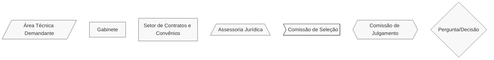

# 🎨 Termo de Execução Cultural (TEC)

## 💎 Dicas

| Item | Resposta |
|------|----------|
| **📢 Precisa de chamamento público?** | Sim, salvo situações excepcionais - art. 6º, § 2º da [Lei Federal nº 14.903/2024](https://www.planalto.gov.br/ccivil_03/_ato2023-2026/2024/lei/l14903.htm). Essas situações ainda não foram regulamentadas por decreto |
| **🤝 Tipos de parceiros** | • Artistas, coletivos ou instituições culturais <br> • Agentes culturais PF, MEIs ou PJs com projetos específicos <br> • Organizações da sociedade civil atuantes na cultura <br> • Coletivos culturais sem CNPJ <br> • CNPJs com ou sem fins lucrativos  |
| **💰 Envolve transferência de recursos?** | Sim: repasse de recursos públicos para execução de ação cultural específica, mediante plano de trabalho |
| **⏳ Vigência máxima** | Não há prazo máximo explícito na lei. Definir conforme o plano de trabalho. Instrumentos plurianuais são permitidos (art. 11) |
| **🔒 Exige prestação de contas formal?** | • Visita Técnica pode substituir relatórios em instrumentos ≤ R$ 200 mil (art. 18, § 1º) <br> • Relatório de Objeto da Execução Cultural (até 120 dias após fim da vigência) <br> • Relatório Financeiro da Execução Cultural (somente em casos de denúncia ou suspeita fundamentada - arts. 19 e 20) <br> • Sanções por descumprimento: devolução de recursos, multa, suspensão (180-540 dias) ou ações compensatórias (art. 21) |
| **👮🏻 Exige gestor/fiscal designado?** | Sim: agente público designado pela autoridade competente (art. 32) para monitoramento e controle, análise de relatórios e verificação do cumprimento do objeto |
| **🛣️ Plano de trabalho obrigatório?** | Sim. Deve conter: descrição do objeto, cronograma de execução e estimativa de custos (art. 13) |

---

## 📌 Definição

O **Termo de Execução Cultural** (TEC) é o instrumento jurídico para transferir recursos públicos a agentes culturais, mediante plano de trabalho definido, visando a realização de ação cultural específica.

---

## 🏛️ Regulamentação

Subseção I - Do Termo de Execução Cultural - da Seção III - Dos Procedimentos por Instrumento - da [Lei Federal nº 14.903/2024](https://www.planalto.gov.br/ccivil_03/_ato2023-2026/2024/lei/l14903.htm) (Marco do Fomento).

---

## 🎯 Objetivos

- Financiar projetos culturais específicos de forma ágil
- Simplificar processos administrativos
- Garantir transparência na aplicação de recursos
- Focar nos resultados culturais definidos no plano de trabalho
- Democratizar acesso ao fomento cultural

---

## 🛠️ Exemplos de aplicação no Iepha-MG

1. Parcerias para conservação/digitalização de acervos
2. Intervenções em bens materiais tombados
3. Contratação de equipes de restauro (exemplo: Ateliê Vitrine ou Laboratório de Restauro)
4. Elaboração de dossiês de tombamento
5. Projetos de educação patrimonial em comunidades
6. Catalogação emergencial de bens culturais em risco
7. Manutenção e programação de espaços culturais

---

## 📋 Regras

=== "✅ Pode"

    **Recursos podem ser usados para (Art. 15):**

    - Prestação de serviços técnicos especializados
    - Aquisição ou locação de equipamentos e materiais
    - Remuneração de equipe de trabalho (com encargos)
    - Diárias de viagem (hospedagem, alimentação, transporte)
    - Despesas com tributos e tarifas bancárias
    - Assessoria jurídica, contábil ou de gestão
    - Alimentação para equipe ou comunidade
    - Desenvolvimento e manutenção de TI
    - Comunicação, divulgação e impulsionamento
    - Manutenção de espaços (aluguel, água, energia)
    - Obras, reformas e aquisição de equipamentos
    - Reembolso de até 20% do valor para despesas do próprio bolso
    
    **Facilidades administrativas (Art. 17):**

    - Prorrogação automática por atraso no repasse
    - Alteração do plano de trabalho sem aditivo (se mantiver valor e objeto)
    - Uso de rendimentos financeiros sem autorização prévia
    - Escolha livre de equipe e fornecedores (sem exigência de procedimentos licitatórios - art. 1º, § 4º do Marco do Fomento)

=== "❌ Não pode"

    ⚠️ **Proibições absolutas:**

    - Celebrar sem chamamento público (salvo exceções do art. 6º, § 2º, ainda não regulamentadas)
    - Exigir contrapartida financeira, em bens ou em serviços, dos agentes culturais (art. 6º, § 3º)
    - Aceitar propostas com conteúdo preconceituoso ou discriminatório (art. 9º, § 5º)

    ⚠️ **Exigências obrigatórias:**

    - Plano de trabalho (art. 13)
    - Especificação das condições de repasse (art. 6º, § 3º)
    - Comprovação de regularidade fiscal (art. 10, § 3º)

---

## 📢 Chamamento público

Em regra, é obrigatória a realização de chamamento público prévio. Até que sejam publicadas as normas sobre as exceções, recomenda-se sempre adotar o chamamento público.

=== "🔄️ Fluxo"

    ```mermaid
        %%{init: { 'flowchart': { 'htmlLabels': true }, 'maxTextSize': 90000 }}%%
            flowchart LR
                subgraph Planejamento
                    A1["Consulta pública e reuniões técnicas"]
                    A2["Proposição técnica da minuta de edital"]
                    A3["Verificação formal: parecer jurídico só se não for utilizada minuta padrão (art. 8º, § 3º)"]
                    A4["Publicação do edital"]

                    A1 --> A2 --> A3 --> A4
                end
                subgraph Processamento
                    B1["Recebimento das propostas (mínimo de 5 dias úteis conforme art. 9º, I)"]
                    B2["Análise pela comissão de seleção"]
                    B3["Resultado provisório e prazos de recursos (3 dias úteis art. 9º, III) / contrarrazões (2 dias úteis art. 9º, III)"]
                    B4["Recebimento e julgamento dos recursos"]
                    B5["Publicação do resultado final"]

                    B1 --> B2 --> B3 --> B4 --> B5
                end
                subgraph Celebração
                    C1["Habilitação dos agentes culturais (após seleção: art. 10, § 1º)"]
                    C2["Convocação de novos agentes (em caso de inabilitação)"]
                    C3["Assinatura dos Termos de Execução Cultural"]

                    C1 --> C2 --> C3
                end
                Planejamento --> Processamento --> Celebração

        classDef default stroke:#333,stroke-width:1px,fill:#f8f8f8,rx:0,ry:6,font-size:15px;

    ```

===+ "⏱️ Prazos relevantes"

    | Etapa | Prazo | Base Legal |
    |-------|-------|------------|
    | Inscrições | 5 dias úteis (mínimo) | Art. 9º, I |
    | Recursos | 3 dias úteis (mínimo) | Art. 9º, III |
    | Contrarrazões (se necessário) | 2 dias úteis (mínimo) | Art. 9º, III |
    | Prestação de contas (Relatório de Objeto) | 120 dias após fim da vigência | Art. 18, I |
    | Prestação de contas (Relatório Financeiro) | 120 dias após notificação | Art. 18, II |
    | Julgamento da prestação de contas | 360 dias após fim da vigência | Art. 21, § 1º |
    | Guarda de documentos pelo agente cultural | 5 anos após fim da vigência | Art. 18, § 3º |
    | Aprovação automática (sem manifestação) | 5 anos após fim da vigência | Art. 18, § 4º |

=== "🔑 Regras-Chave"

    - No Marco Regulatório do Fomento à Cultura, os chamamentos públicos podem ser (art. 6º, I e II):
        - **De fluxo contínuo**: celebração de Termos à medida que as propostas são recebidas
        - **De fluxo ordinário**: concentração do recebimento, análise e seleção em período determinado
    - É indispensável fazer consulta pública ou processo equivalente antes de publicar o edital (art. 8º, § 1º)
    - Nem sempre é necessária uma nova análise jurídica do edital ou do Termo: quando utilizada minuta padronizada (já analisada pelo jurídico de um órgão público), a **autoridade responsável pela publicação do edital** pode assumir a _verificação de adequação formal da minuta de edital_ (art. 8º, § 3º)
    - Seleção de propostas pode ser feita por voluntários credenciados ou pareceristas contratados (art. 9º, § 3º)
    - Fase de habilitação somente após seleção de propostas (art. 10, § 1º)
    - Cadastros prévios (como o Descentra Cultura) são aceitos (art. 9º, § 2º e art. 10, § 4º)
    - Inscrições orais e busca ativa de propostas são opções para agentes culturais de grupos vulneráveis (art. 8º, § 6º)
    - Propostas plurianuais são aceitas (art. 11)
    - Não há limitação de vigência máxima para Termos de Execução Cultural

=== "🔮 Destino dos bens adquiridos"

    Conforme  art. 16 do Marco do Fomento, os equipamentos e materiais comprados com recursos do Termo podem permanecer com o agente cultural, **desde que sejam usados (direta ou indiretamente) para atividades culturais que beneficiem o público**.

---

## 🛣️ Plano de trabalho

**Um bom plano de trabalho** deve responder às seguintes perguntas (art. 13):

- **O quê?** Descrição do objeto da ação cultural, metas, produtos e resultados esperados  
- **Como?** Metodologia e critérios de aceitação de cada meta  
- **Onde?** Em qual meio (SEI, processo físico) as comprovações serão entregues  
- **Quem?** Responsável pela entrega e responsável pela aceitação de cada meta  
- **Quando?** Cronograma de execução com prazos para início e entrega  
- **Quanto?** Estimativa de custos (§ 1º do art. 13: não é necessário detalhar cada item de despesa)  

## 💸 Estimativa de custos

A **estimativa de custos**, prevista pelo art. 13, III do Marco do Fomento, ainda não foi regulamentada.

Entretanto, o próprio Marco do Fomento estabelece que a estimativa de custos deverá bastar para demonstrar o planejamento financeiro da ação cultural **sem necessidade de detalhamento de cada item de despesa**.

Além disso, também há a previsão de que a estimativa de custos seja avaliada de acordo com tabelas referenciais de valores, análise de especialistas e técnicos da adminsitração pública ou outros métodos de identificação de valores praticados no mercado.

O art. 45 do Marco do Fomento prevê que os entes federativos deverão criar ou atualizar tabelas referenciais de valores para facilitar a análise de compatibilidade aos preços de mercado das estimativas de custos dos planos de trabalho dos TECs. Porém, essas tabelas provavelmente só serão concretizadas após regulamentação estadual do Marco do Fomento.

Tendo isso em vista, é recomendável utilizar tabelas sucintas de estimativa de custos, objetivas e claras, sem necessidade de detalhamento minucioso, mas que efetivem a demonstração do planejamento financeiro ao leitor. Infelizmente, ainda não há modelo disponível.

Por fim, é importante ter em mente sua felixibilidade (art. 13, § 3º): valores do projeto podem divergir de valores de mercado em casos excepcionais (comunidades tradicionais, territórios remotos, afetados por desastres ambientais etc.).

---

## 👀 Monitoramento e controle

O TEC prevê que a autoridade competente (dirigente do órgão) designe **agentes públicos** para executar rotinas de monitoramento e controle da implementação da ação cultural (art. 32).

Não é necessário mais que um agente, embora este possa contar com apoio técnico de outras áreas de seu órgão, bem como serviços contratados com terceiros ou decorrentes da celebração de parcerias.

As rotinas de monitoramento e controle devem priorizar o efetivo cumprimento do objeto das ações culturais (art. 31). O agente público também pode solicitar ao agente cultural, a qualquer tempo, informações sobre o cumprimento do objeto do TBC.

Ao fim da vigência do TEC, o agente público deverá observar procedimentos específicos para concluir a prestação de contas. Esses procedimentos podem variar: visitas técnicas, análise de relatório de execução do objeto cultural (se exigível) ou, ainda, análise de relatório de execução financeira (se houver suspeita fundamentada ou denúncias).

---

## ✏️ Alteração do Termo de Execução Cultural

O Termo de Execução Cultural pode ser alterado durante sua vigência, com procedimentos simplificados que facilitam ajustes necessários à execução do objeto.

=== "📝 Regra Geral"

    A alteração do Termo de Execução Cultural será formalizada por **termo aditivo** (art. 17, caput).

=== "🚫 Dispensa de Termo Aditivo"

    **Prorrogação automática por atraso no repasse**:

    - Quando a administração pública der causa ao atraso na liberação dos recursos
    - A prorrogação é feita de ofício (automaticamente)
    - O saldo de recursos permanece na conta para continuidade da execução (art. 17, § 2º)

    **Alteração do plano de trabalho**:

    - Desde que não haja modificação do valor global do instrumento
    - Desde que não haja modificação substancial do objeto da ação cultural
    - Alterações de pequeno percentual ou valor podem ser feitas pelo agente cultural e apenas comunicadas depois, sem autorização prévia (art. 17, § 3º - mas ainda aguarda regulamentação)

=== "💰 Alterações Permitidas"

    **Uso de rendimentos financeiros (art. 17, § 5º):**

    - O agente cultural pode aplicar rendimentos de ativos financeiros em benefício do objeto
    - Não necessita autorização prévia da administração pública
    - Deve seguir as finalidades previstas no Termo

    **Reajuste por inflação (art. 17, § 4º):**

    - A variação inflacionária pode justificar termo aditivo
    - Permite alteração do valor global do instrumento
    - Protege o projeto contra perda do poder de compra

===+ "🎯 Resumo Prático"

    | Situação | Necessita Aditivo? | Necessita Autorização Prévia? |
    |----------|-------------------|------------------------------|
    | Prorrogação por atraso no repasse | ❌ Não | ❌ Não (automática) |
    | Alteração do plano sem mudar valor/objeto | ❌ Não | ❌ Não |
    | Alteração de pequeno percentual/valor | ❌ Não | ❌ Não (comunicar depois) |
    | Uso de rendimentos financeiros | ❌ Não | ❌ Não |
    | Reajuste por inflação | ✅ Sim | ✅ Sim |
    | Alteração substancial do objeto | ✅ Sim | ✅ Sim |
    | Alteração do valor global | ✅ Sim | ✅ Sim |

---

## 🔒 Prestação de contas

O processo varia conforme o valor do Termo e ocorrência de irregularidades, em 3 modalidades:

=== "📋 Modalidades"

    **1. Visita Técnica (≤ R$ 200 mil: art. 18, § 1º):**

    - Substitui relatórios se o agente público considerar suficiente
    - Agente público deve redigir um parecer técnico após verificação presencial
    - Pode concluir pelo cumprimento ou solicitar Relatório de Objeto

    **2. Relatório de Objeto da Execução Cultural:**

    - Obrigatório quando Visita Técnica não for suficiente ou instrumento > R$ 200 mil
    - Prazo: até 120 dias após fim da vigência
    - Foco no cumprimento do objeto cultural

    **3. Relatório Financeiro da Execução Cultural:**

    - Somente se Relatório de Objeto for insuficiente (art. 19, III) ou houver denúncia de irregularidade (art. 20)
    - Prazo: até 120 dias após notificação específica
    - Exige demonstração financeira detalhada

=== "💣 Sanções por não cumprimento"

    A autoridade responsável pode determinar (art. 21, IV):

    - **Devolução de recursos** proporcional à inexecução
    - **Pagamento de multa** (conforme regulamento)
    - **Suspensão** da possibilidade de celebrar instrumento no Marco do Fomento por 180 a 540 dias

    **Atenuantes:**

    - Caso fortuito ou força maior afasta sanções (art. 21, § 4º)
    - Sanções podem ser convertidas em ações compensatórias (art. 21, § 5º)
    - Medidas só são cumulativas em casos de comprovada má-fé (art. 21, § 3º)

===+ "🎯 Tabela sintética"

    | Item | Regra | Prazo | Aplicação |
    |------|-------|-------|-----------|
    | **Visita Técnica** | Substitui relatórios para termos ≤ R$ 200 mil, se suficiente | Durante ou após vigência | Gera Relatório de Verificação Presencial que confirma cumprimento ou solicita Relatório de Objeto (Art. 18, § 1º e § 2º) |
    | **Relatório de Objeto** | Documentação comprobatória do cumprimento do objeto | Até 120 dias após fim da vigência | Quando Visita Técnica não for/foi suficiente (Art. 18, § 2º, II) |
    | **Relatório Financeiro** | Documentação comprobatória dos registros financeiros | Até 120 dias após notificação | Obrigatório apenas nos casos do Art. 19, III (Relatório de Objeto insuficiente) ou Art. 20 (denúncia de irregularidade) |
    | **Guardar Documentos** | Agente cultural deve manter toda documentação | 5 anos após fim da vigência | Aplicável a todos os termos (Art. 18, § 3º) |
    | **Aprovação Automática** | Contas aprovadas se não houver manifestação | 5 anos após fim da vigência | Exceto se houver dolo, fraude ou simulação (Art. 18, § 4º) |

---

## 🔍 Saiba mais!

Modelos e documentos de referência (editais, termos, planos de trabalho etc.) podem ser encontrados no nossa [Biblioteca](../../biblioteca/index.md). Pra facilitar, a APPI/IEPHA-MG fez uma seleção de documentos:

- [Minuta Padrão de Edital de Fomento à Execução de Ações Culturais](https://www.gov.br/cultura/pt-br/assuntos/politica-nacional-aldir-blanc/modelos-de-editais/modelos-de-editais-pnab/edital-fomento-a-execucao-de-acoes-culturais)
- [Anexo 01 - Categorias](https://www.gov.br/cultura/pt-br/assuntos/politica-nacional-aldir-blanc/modelos-de-editais/modelos-de-editais-pnab/Anexo%20I%20-%20Categorias)
- [Anexo 02 - Formulário de Inscrição e Plano de Trabalho](https://www.gov.br/cultura/pt-br/assuntos/politica-nacional-aldir-blanc/modelos-de-editais/modelos-de-editais-pnab/anexo-ii-formulario-de-inscricao-e-plano-de-trabalho)
- [Anexo 03 - Critérios de Avaliação](https://www.gov.br/cultura/pt-br/assuntos/politica-nacional-aldir-blanc/modelos-de-editais/modelos-de-editais-pnab/anexoiiicriteriosdeavaliacaoMinutaPadrodeEditaldeFomentoExecuodeAesCulturais.docx)
- [Anexo 04 - Termo de Execução Cultural](https://www.gov.br/cultura/pt-br/assuntos/politica-nacional-aldir-blanc/modelos-de-editais/modelos-de-editais-pnab/anexo-iv-termo-de-execucao-cultural)
- [Anexo 05 - Relatório de Execução de Objeto](https://www.gov.br/cultura/pt-br/assuntos/politica-nacional-aldir-blanc/modelos-de-editais/modelos-de-editais-pnab/anexo-v-relatorio-de-objeto-da-execucao-cultural)
- [Anexo 06 - Declaração para coletivo sem CNPJ](https://www.gov.br/cultura/pt-br/assuntos/politica-nacional-aldir-blanc/modelos-de-editais/modelos-de-editais-pnab/anexo-vi-declaracao-para-coletivo-sem-cnpj)
- [Anexo 07 - Declaração para cotas (negros e indígenas)](https://www.gov.br/cultura/pt-br/assuntos/politica-nacional-aldir-blanc/modelos-de-editais/modelos-de-editais-pnab/anexo-vii-declaracao-para-cotas-pessoas-negras-e-indigenas)
- [Anexo 08 - Declaração para cotas (PCDs)](https://www.gov.br/cultura/pt-br/assuntos/politica-nacional-aldir-blanc/modelos-de-editais/modelos-de-editais-pnab/anexo-viii-declaracao-para-cotas-pcd)
- [Anexo 09 - Formulário de recurso](https://www.gov.br/cultura/pt-br/assuntos/politica-nacional-aldir-blanc/modelos-de-editais/modelos-de-editais-pnab/anexo-ix-formulario-de-recurso)

---

## 🔄️ Fluxograma

Todos os procedimentos do fluxograma referem-se ao [Marco do Fomento - Lei Federal nº 14.903/2024](https://www.planalto.gov.br/ccivil_03/_ato2023-2026/2024/lei/l14903.htm). Diferentes formatos das caixinhas significam diferentes setores responsáveis por cada atividade, conforme legenda.

```mermaid
%%{init: { 'flowchart': { 'htmlLabels': true, 'wrappingWidth': 180 }, 'maxTextSize': 90000 }}%%
flowchart TD
%% Etapas iniciais
A@{ shape: lean-r, label: "Solicitar parceria" } --> B@{ shape: rect, label: "Analisar solicitação" }
B --> C@{ shape: diamond, label: "Parceria é viável?" }
C -->|Não| D@{ shape: rect, label: "Informar e justificar negativa à área técnica por e-mail" }
D --> RES((("Fim")))
C -->|Sim| E@{ shape: diamond, label: "Necessita Chamamento Público? (art. 6º, § 2º)" }
E -->|Sim| cham
E -->|"Não (verificar regulamentação por decreto)"| disp

%% Chamamento Público
subgraph cham ["Chamamento Público"]
F1@{ shape: lean-r, label: "Desenvolver/revisar minuta de edital de chamamento público e Termo de Execução" } --> F2@{ shape: diamond, label: "Minutas validadas?" }
F2 -->|Não| F1
F2 -->|Sim| F3@{ shape: rect, label: "Encaminhar processo ao setor de Contratos e Convênios" }
F3 --> F4@{ shape: rounded, label: "Instruir processo no SEI" }
F4 --> F5@{ shape: rounded, label: "Realizar consulta pública ou processo equivalente (art. 8º, § 1º)" }
F5 --> F6@{ shape: rect, label: "Revisar edital conforme consulta pública" }
F6 --> F7@{ shape: diamond, label: "Passará por análise jurídica? (art. 8º, § 3º)" }
F7 -->|Sim| F8@{ shape: trap-b, label: "Análise Jurídica" }
F8 --> F9@{ shape: rounded, label: "Promover ajustes e anexar nota saneadora" }
F7 -->|Não| F10@{ shape: rect, label: "Providenciar parecer da autoridade competente pela publicação do edital" }
F9 --> F10
F10 --> F11@{ shape: rect, label: "Assinar e publicar edital" }
F11 --> F12@{ shape: odd, label: "Receber propostas (mínimo de 5 dias úteis: art. 9º, I)" }
F12 --> F13@{ shape: odd, label: "Analisar propostas" }
F13 --> F14@{ shape: rounded, label: "Publicar resultado provisório e aguardar prazo para recursos (3 dias úteis: art. 9º, III)" }
F14 --> F15@{ shape: hex, label: "Receber, analisar e julgar recursos" }
F15 --> F16@{ shape: diamond, label: "Recursos alteraram classificação?" }
F16 -->|Sim| F17@{ shape: hex, label: "Receber e analisar contrarrazões (2 dias úteis: art. 9º, III)" }
F17 --> F18@{ shape: rounded, label: "Publicar resultado final" }
F16 -->|Não| F18
end

%% Dispensa de Chamamento
subgraph disp ["Dispensa de Chamamento"]
G1@{ shape: lean-r, label: "Elaborar parecer técnico justificando dispensa de chamamento" } --> G2@{ shape: lean-r, label: "Desenvolver/revisar minuta de Termo de Execução" }
G2 --> G3@{ shape: diamond, label: "Minutas validadas?" }
G3 -->|Não| G2
G3 -->|Sim| G4@{ shape: rect, label: "Encaminhar processo ao setor de Contratos e Convênios" }
G4 --> G5@{ shape: rounded, label: "Instruir processo no SEI" }
G5 --> G6@{ shape: trap-b, label: "Análise Jurídica (se aplicável)" }
G6 --> G7@{ shape: rounded, label: "Promover ajustes e anexar nota saneadora" }
end

%% Habilitação e assinatura - comum para ambos fluxos
F18 --> H1@{ shape: rounded, label: "Habilitar agentes culturais selecionados" }
G7 --> H1
H1 --> H2@{ shape: diamond, label: "Houve inabilitação?" }
H2 -->|Sim| H3@{ shape: rounded, label: "Convocar e habilitar novos agentes" }
H3 --> H4@{ shape: rounded, label: "Assinatura dos instrumentos jurídicos" }
H2 -->|Não| H4

%% Execução e prestação de contas
H4 --> I1@{ shape: lean-r, label: "Monitorar execução do objeto cultural" }
I1 --> I2@{ shape: rounded, label: "Iniciar prestação de contas" }
I2 --> I3@{ shape: diamond, label: "Projeto possui denúncia ou suspeita fundamentada de irregularidade? (art. 20, II)" }
I3 -->|Sim| I10@{ shape: rounded, label: "Notificar agente cultural para apresentar Relatório Financeiro da Execução Cultural (art. 18, II)" }
I3 -->|Não| I4@{ shape: diamond, label: "Projeto tem valor ≤ R$ 200 mil? (art. 18, § 1º)" }
I4 -->|Sim| I5@{ shape: rounded, label: "Realizar visita técnica e emitir Relatório de Verificação Presencial (art. 18, § 2º)" }
I5 --> I6@{ shape: diamond, label: "Relatório confirma cumprimento?" }
I6 -->|Sim| RES
I6 -->|Não| I7@{ shape: rounded, label: "Notificar agente cultural para apresentar Relatório de Objeto da Execução Cultural (art. 18, § 2º, I)" }
I4 -->|Não| I7
I7 --> I8@{ shape: rounded, label: "Receber Relatório de Objeto da Execução Cultural (até 120 dias: art. 18, § 2º, I)" }
I8 --> I9@{ shape: diamond, label: "Relatório confirma cumprimento?" }
I9 -->|Sim| RES
I9 -->|Não| I10
I10 --> I11@{ shape: rounded, label: "Receber Relatório Financeiro (até 120 dias: art. 18, § 2º, II)" }
I11 --> I12@{ shape: diamond, label: "Relatório Financeiro aprovado?" }
I12 -->|Sim| RES
I12 -->|Não| I13@{ shape: rounded, label: "Aplicar sanções / ações compensatórias" }
I13 --> RES

classDef default stroke:#333,stroke-width:1px,fill:#f8f8f8,rx:0,ry:6,font-size:15px;
```




