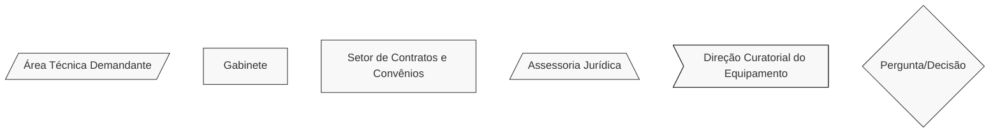
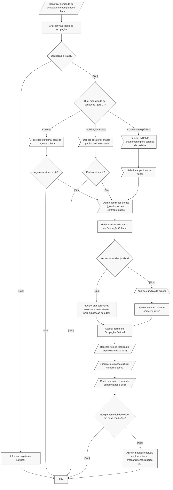

# 🎪 Termo de Ocupação Cultural (TOC)

## 💎 Dicas

| Item | Resposta |
|------|----------|
| **📢 Precisa de Chamamento Público?** | Não: art. 6º, § 1º e art. 27 da [Lei Federal nº 14.903/2024](https://www.planalto.gov.br/ccivil_03/_ato2023-2026/2024/lei/l14903.htm). Apesar disso, a administração pode fazer chamamento, se quiser |
| **🤝 Tipos de parceiros** | • Agentes culturais   • Artistas e coletivos culturais   • Produtores culturais   • Organizações da sociedade civil voltadas à cultura   • Instituições de ensino e pesquisa   • Expositores e curadores   • Grupos artísticos   • Microempresários individuais e empresários individuais   • Sociedades empresárias ou simples da área cultural   • Feirantes, artesãos, praças de alimentação e afins (art. 28, § 1º) |
| **💰 Envolve transferência de recursos?** | Não: instrumento não envolve repasse de recursos públicos (art. 4º, II, "a").    Pode haver uso gratuito, cobrança de taxa de uso ordinário ou fornecimento de bens/serviços pelo ocupante (art. 28) |
| **⏳ Vigência máxima** | Não há prazo máximo explícito na lei. Vigência deve ser definida conforme duração da atividade cultural e disponibilidade do equipamento |
| **🔒 Exige prestação de contas formal?** | Não exige prestação de contas (art. 28, § 3º)   • Processo simplificado: não se aplicam os ritos previstos nos arts. 13 a 21 da Lei   • A forma de comprovação deve ser definida no próprio Termo de Ocupação Cultural |
| **👮🏻 Exige gestor/fiscal designado?** | Sim: agente público designado para acompanhamento da cooperação e verificação do cumprimento das obrigações acordadas (art. 32), mas sua incumbência se resume à verificação do cumprimento dos compromissos assumidos.    No caso dos Termos de Ocupação Cultural, é desejável que esse agente público esteja relacionado à instância responsável pela direção curatorial do equipamento público (mencionada pelo art. 27) |
| **🛣️ Plano de trabalho obrigatório?** | Não. O instrumento não exige plano de trabalho. Basta definir no Termo: datas de ocupação, espaço utilizado, atividade a ser realizada e deveres do ocupante, incluindo contraprestações, como pagamento de taxa de uso ordinário ou fornecimento de bens e serviços, se for o caso |

---

## 📌 Definição:

Instrumento jurídico para promover o uso ordinário de equipamentos públicos culturais por agentes culturais, sem repasse de recursos pela administração pública, com previsão da data de ocupação e dos deveres de cuidado do agente cultural ocupante.

---

## 🏛️ Regulamentação:

Subseção IV - Do Termo de Ocupação Cultural - da Seção III - Dos Procedimentos por Instrumento - da [Lei Federal nº 14.903/2024](https://www.planalto.gov.br/ccivil_03/_ato2023-2026/2024/lei/l14903.htm) (Marco Regulatório do Fomento à Cultura - MRFC).

---

## 🎯 Objetivos

- Democratizar o acesso aos equipamentos públicos culturais
- Otimizar o uso da infraestrutura cultural pública
- Fomentar a produção cultural descentralizada
- Promover a ocupação qualificada de espaços culturais
- Facilitar o acesso de agentes culturais a equipamentos especializados

---

## 🛠️ Exemplos de aplicação no Iepha-MG:

Desde que haja espaços físicos disponíveis e datas livres na programação, um Termo de Ocupação Cultural pode servir para:

1. Ocupação de salas e espaços do Centro do Patrimônio para exposições temporárias.
2. Destinação de salas multiuso para pesquisas e atividades formativas.
3. Eventos culturais e artísticos no pátio central do Centro do Patrimônio.
4. Utilização do Laboratório de Restauro para atividades técnicas compartilhadas com especialistas, universidades etc.
5. Uso de auditórios para seminários e palestras.
6. Ocupação de espaços para oficinas de educação patrimonial.
7. Utilização de áreas como o pátio central para feiras de artesanato tradicional mineiro, dentre outras possibilidades.

---

## 📋 Regras

=== "✅ Pode"

    **Características do instrumento:**

    - Uso ordinário gratuito de equipamentos públicos culturais
    - Formalização sem necessidade de chamamento público
    - Natureza jurídica de permissão de uso de bem público
    - Processo simplificado de celebração
    - Utilização temporária de espaços para atividades culturais

=== "❌ Não pode"

    ⚠️ **Limitações:**

    - Não envolve transferência de recursos públicos (art. 4º, II, "a")
    - Não se confunde com uso especial (art. 28, § 2º: uso especial envolve autorizações, permissões ou concessões de bem público)
    - Não é obrigatório firmar Termo de Ocupação Cultural se a gestão de equipamento público já for realizada por parceria vigente sob MROSC ou demais instrumentos jurídicos (art. 26, parágrafo único)

=== "↩️ Contraprestações"
    
    **É possível (não obrigatório) exigir do parceiro (art. 28):**

    - Pagamento de taxa de uso ordinário (se for previsto em regulamento)
    - Fornecimento de bens ou serviços para modernização, manutenção, comunicação, desenvolvimento, aquisição de móveis, reforma ou aperfeiçoamento das instalações do equipamento público

---

## ✒️ Celebração

Não há necessidade de chamamento público. A celebração é por **decisão discricionária da administração pública**, baseada em (arts. 6º e 27):

- **Convite:** Direção curatorial do equipamento convida o agente cultural
- **Solicitação:** Interessado apresenta pedido de uso ordinário aceito como pedido avulso
- **Seleção:** Chamamento público para seleção de pedidos de uso ordinário (opcional, somente se for escolha do órgão público)

---

## 🔒 Prestação de contas

**Processo simplificado:** Não se aplicam os ritos previstos nos arts. 13 a 21 da Lei (art. 28, § 3º), em razão da natureza jurídica do instrumento como permissão de uso de bem público.

Basta cumprir o que ficar combinado no Termo de Ocupação Cultural, que pode ser uma visita técnica ou um simples relatório de resultados.

---

## 🔍 Saiba mais!

Modelos e documentos de referência (termos, regulamentos de uso etc.) podem ser encontrados na nossa [Biblioteca](../../biblioteca/index.md).

Segue um exmeplo prático de Termo de Ocupação Cultural já celebrado no âmbito do Governo Federal:

- [Modelo de Termo de Ocupação Cultural - FUNARTE](https://www.gov.br/funarte/pt-br/editais-1/2024/programa-funarte-aberta-2025-ocupacao-dos-espacos-culturais-da-funarte-mg-e-sp/AnexoIModeloTERMODEOCUPAOCULTURALFUNARTEProjurem191224psrevisoprojur.docx)

---

## 🔄️ Fluxograma

Todos os procedimentos do fluxograma referem-se à [Lei Federal nº 14.903/2024](https://www.planalto.gov.br/ccivil_03/_ato2023-2026/2024/lei/l14903.htm) (Marco Regulatório do Fomento à Cultura - MRFC). Diferentes formas das caixinhas significam diferentes setores responsáveis por cada atividade, conforme legenda.

