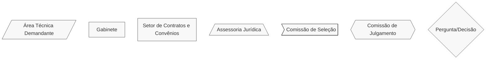

# 🏆 Termo de Premiação Cultural (TPC)

## 💎 Dicas

| Item | Resposta |
|------|----------|
| **📢 Precisa de chamamento público?** | Sim, salvo situações excepcionais - art. 6º, § 2º da [Lei Federal nº 14.903/2024](https://www.planalto.gov.br/ccivil_03/_ato2023-2026/2024/lei/l14903.htm). Essas situações ainda não foram regulamentadas por decreto |
| **🤝 Tipos de parceiros** | • Artistas, coletivos ou instituições culturais <br> • Mestres da cultura popular e detentores de saberes tradicionais <br> • Agentes culturais PF, MEIs ou PJs com ações culturais já realizadas • Arquitetos, restauradores, educadores ou especialistas em preservação patrimonial |
| **💰 Envolve transferência de recursos?** | Sim: pagamento direto ao agente cultural como reconhecimento por contribuição já realizada, sem exigência de contrapartida ou prestação de contas (art. 22) |
| **⏳ Vigência máxima** | Não se aplica: natureza jurídica de doação sem encargo, sem estabelecimento de obrigações futuras (art. 22) |
| **🔒 Exige prestação de contas formal?** | Não: termo produz efeito de recibo do pagamento direto (art. 23) |
| **👮🏻 Exige gestor/fiscal designado?** | Não: ritos de monitoramento e prestação de contas não se aplicam (art. 23, parágrafo único). |
| **🛣️ Plano de trabalho obrigatório?** | Não: plano de trabalho não é necessário (art. 23, parágrafo único) |

---

## 📌 Definição:
O **Termo de Premiação Cultural** (TPC) é o instrumento jurídico para reconhecer relevante contribuição de agentes culturais, por ação ou ações já realizadas, mediante transferência de recursos a título de doação sem encargo e sem estabelecimento de obrigações futuras (sem contrapartida ou prestação de contas).

---

## 🏛️ Regulamentação:
Subseção II - Do Termo de Premiação Cultural - da Seção III - Dos Procedimentos por Instrumento - da [Lei Federal nº 14.903/2024](https://www.planalto.gov.br/ccivil_03/_ato2023-2026/2024/lei/l14903.htm) (Marco do Fomento).

---

## 🎯 Objetivos

- Reconhecer contribuições significativas de agentes culturais
- Valorizar trajetórias artísticas e culturais consolidadas
- Simplificar processos de apoio ao setor cultural
- Garantir transparência na destinação de recursos públicos
- Fomentar a continuidade de práticas culturais relevantes

---

## 🛠️ Exemplos de aplicação no Iepha-MG:

1. Reconhecimento de mestres da cultura popular mineira.
2. Premiação de trajetórias na preservação do patrimônio cultural.
4. Reconhecimento de especialistas em restauração e conservação.
5. Concurso de fotografias sobre patrimônio (Queijo Minas Artesanal, Sistemas Culinários da Cozinha Mineira Milho e Mandioca, Barroco Mineiro etc.)
6. Valorização de artesãos tradicionais e detentores de saberes.
7. Concurso de iniciativas de educação patrimonial.

## 📋 Regras

=== "✅ Pode"

    **Características do prêmio:**

    - Reconhecimento de relevante contribuição cultural já realizada
    - Premiação baseada em trajetória e impacto cultural comprovados
    - Valorização de agentes culturais por trabalhos já desenvolvidos
    - Incentivo à continuidade de práticas culturais significativas

    **Facilidades administrativas:**

    - Não requer plano de trabalho (art. 23, parágrafo único)
    - Não exige prestação de contas
    - Natureza jurídica de doação sem encargo (art. 22)
    - Processo simplificado de habilitação
    - Inscrição pode ser feita pelo próprio interessado **ou por terceiro** (art. 22, § 1º)

=== "❌ Não pode"

    ⚠️ **Proibições absolutas:**

    - Celebrar sem chamamento público (salvo exceções previstas pelo art. 6º, § 2º, ainda não regulamentadas)
    - Exigir contrapartida financeira, em bens ou em serviços, dos agentes culturais (art. 6º, § 3º)
    - Exigir execução de ações futuras como condição para o prêmio (art. 22)
    - Exigir prestação de contas (art. 23)
    - Aceitar propostas com conteúdo preconceituoso ou discriminatório (art. 9º, § 5º)

    ⚠️ **Exigências obrigatórias:**

    - Informação sobre incidência tributária no edital (art. 22, § 2º), com isenção de IRPF no caso de Pessoa Física, conforme [Parecer nº 64/2024 da AGU](https://www.gov.br/agu/pt-br/comunicacao/noticias/PARECERn.000642024DECORCGUAGU.pdf)

---

## 📢 Chamamento público

Em regra, é obrigatória a realização de chamamento público prévio. Até que sejam publicadas as normas sobre as exceções, recomenda-se sempre adotar o chamamento público.

=== "🔄️ Fluxo"

    ```mermaid
        %%{init: { 'flowchart': { 'htmlLabels': true }, 'maxTextSize': 90000 }}%%
            flowchart LR
                subgraph Planejamento
                    A1["Consulta pública e reuniões técnicas"]
                    A2["Proposição técnica da minuta de edital"]
                    A3["Verificação formal: parecer jurídico só se não for utilizada minuta padrão (art. 8º, § 3º)"]
                    A4["Publicação do edital"]

                    A1 --> A2 --> A3 --> A4
                end
                subgraph Processamento
                    B1["Recebimento de candidaturas (próprio interessado ou terceiro: art. 22, § 1º) - mínimo de 5 dias úteis (art. 9º, I)"]
                    B2["Análise pela comissão de seleção"]
                    B3["Resultado provisório e prazos de recursos (3 dias úteis art. 9º, III) / contrarrazões, se necessário (2 dias úteis art. 9º, III)"]
                    B4["Recebimento e julgamento dos recursos"]
                    B5["Publicação do resultado final"]

                    B1 --> B2 --> B3 --> B4 --> B5
                end
                subgraph Celebração
                    C1["Habilitação dos agentes culturais (após seleção: art. 10, § 1º)"]
                    C2["Convocação de novos agentes (em caso de inabilitação)"]
                    C3["Assinatura dos Termos de Premiação Cultural"]

                    C1 --> C2 --> C3
                end
                Planejamento --> Processamento --> Celebração

        classDef default stroke:#333,stroke-width:1px,fill:#f8f8f8,rx:0,ry:6,font-size:15px;

    ```

===+ "⏱️ Prazos relevantes"

    | Etapa | Prazo | Base Legal |
    |-------|-------|------------|
    | Consulta pública | Não há prazo mínimo estabelecido, mas é obrigatória alguma forma de participação social | Art. 8º, § 1º |
    | Inscrições | 5 dias úteis (mínimo) | Art. 9º, I |
    | Recursos | 3 dias úteis (mínimo) | Art. 9º, III |
    | Contrarrazões (se necessário) | 2 dias úteis (mínimo) | Art. 9º, III |

=== "🔑 Regras-Chave"

    - No Marco Regulatório do Fomento à Cultura, os chamamentos públicos podem ser (art. 6º, I e II):
        - **De fluxo contínuo**: celebração de Termos à medida que as propostas são recebidas
        - **De fluxo ordinário**: concentração do recebimento, análise e seleção em período determinado
    - É indispensável fazer consulta pública ou processo equivalente antes de publicar o edital (art. 8º, § 1º)
    - Nem sempre é necessária uma nova análise jurídica do edital ou do Termo: quando utilizada minuta padronizada (já analisada pelo jurídico de um órgão público), a **autoridade responsável pela publicação do edital** pode assumir a _verificação de adequação formal da minuta de edital_ (art. 8º, § 3º)
    - Seleção de propostas pode ser feita por voluntários credenciados ou pareceristas contratados (art. 9º, § 3º)
    - Fase de habilitação somente após seleção de propostas (art. 10, § 1º)
    - Cadastros prévios (como o Descentra Cultura) são aceitos (art. 9º, § 2º e art. 10, § 4º)
    - Inscrições orais e busca ativa de propostas são opções para agentes culturais de grupos vulneráveis (art. 8º, § 6º)
    - **Peculiaridade:** Edital deve conter seção informativa sobre incidência tributária (art. 22, § 2º)

---

## 💰 Tratamento tributário

**Isenção de Imposto de Renda:** Premiações culturais concedidas após a vigência do Marco Regulatório do Fomento à Cultura (29/06/2024) estão isentas de imposto de renda para pessoas físicas, pois possuem natureza jurídica de doação sem encargo, conforme [Parecer nº 64/2024 da AGU](https://www.gov.br/agu/pt-br/comunicacao/noticias/PARECERn.000642024DECORCGUAGU.pdf).

## 🔒 Prestação de contas

Não prevê prestação de contas, pois o poder público está premiando algo que reconhece já ter acontecido. Por isso, não pode exigir nenhuma contrapartida ou compromisso posterior do agente cultural (art. 22).

---

## 🔍 Saiba mais!

Modelos e documentos de referência (editais, termos, critérios de avaliação etc.) podem ser encontrados na nossa [Biblioteca](../../biblioteca/index.md). Mas, pra facilitar, a APPI/IEPHA-MG fez uma seleção de documentos pra você:

- [Minuta Padrão de Edital de Premiação para Culturas Populares](https://www.gov.br/cultura/pt-br/assuntos/politica-nacional-aldir-blanc/modelos-de-editais/edital-de-premiacao-culturas-populares/minuta-edital-de-premiacao-culturas-populares.docx)
- [Modelo de Edital Simplificado para Termo de Premiação Cultural (PDF editável)](https://www.gov.br/cultura/pt-br/assuntos/politica-nacional-aldir-blanc/modelos-de-editais/premiacao-cultural-com-recursos-da-pnab-em-pdf-editavel/24_pnab_edital_simplificado_pdf_editavel/view)
- [Anexo 1: Formulário de Inscrição](https://www.gov.br/cultura/pt-br/assuntos/politica-nacional-aldir-blanc/modelos-de-editais/premiacao-cultural-com-recursos-da-pnab-em-pdf-editavel/anexo_1_formulario_de_inscricao/view)
- [Anexo 2: Roteiro para Inscrição Oral ou por Vídeo](https://www.gov.br/cultura/pt-br/assuntos/politica-nacional-aldir-blanc/modelos-de-editais/premiacao-cultural-com-recursos-da-pnab-em-pdf-editavel/anexo_2__roteiro_para_inscricao_oral_ou_por_video/view)
- [Anexo: 3 Declaração Representação Grupo ou Coletivo](https://www.gov.br/cultura/pt-br/assuntos/politica-nacional-aldir-blanc/modelos-de-editais/premiacao-cultural-com-recursos-da-pnab-em-pdf-editavel/anexo_3_declaracao_representacao_grupo_ou_coletivo/view)
- [Anexo 4: Termo de Premiação Cultural](https://www.gov.br/cultura/pt-br/assuntos/politica-nacional-aldir-blanc/modelos-de-editais/premiacao-cultural-com-recursos-da-pnab-em-pdf-editavel/anexo_4_termo_de_premiacao_cultural/view)
- [Anexo 5: Formulário de Recurso](https://www.gov.br/cultura/pt-br/assuntos/politica-nacional-aldir-blanc/modelos-de-editais/premiacao-cultural-com-recursos-da-pnab-em-pdf-editavel/anexo_5_formulario_de_recurso/view)

---

## 🔄️ Fluxograma

Todos os prazos do fluxograma referem-se à [Lei Federal nº 14.903/2024](https://www.planalto.gov.br/ccivil_03/_ato2023-2026/2024/lei/l14903.htm) (Marco do Fomento). Diferentes formas das caixinhas significam diferentes setores responsáveis por cada atividade, conforme legenda.

```mermaid
%%{init: { 'flowchart': { 'htmlLabels': true }, 'maxTextSize': 90000 }}%%
flowchart TD
    A@{ shape: lean-r, label: "Solicitar premiação" } --> B@{ shape: rect, label: "Analisar solicitação" }
    B --> C@{ shape: diamond, label: "Premiação é viável?" }
    C -->|Não| D@{ shape: rect, label: "Informar e justificar negativa à área técnica por e-mail" } --> AE@{ shape: double-circle, label: "Fim" }
    C -->|Sim| E@{ shape: diamond, label: "Necessita Chamamento Público? (art. 6º, § 2º)" }
    E -->|Não| F@{ shape: lean-r, label: "Elaborar parecer técnico justificando dispensa de chamamento" }
    F --> G@{ shape: rect, label: "Desenvolver/revisar minuta de edital de chamamento público (se necessário) e Termo de Premiação" }
    E -->|Sim| G
    G --> H@{ shape: lean-r, label: "Analisar minutas" }
    H --> I@{ shape: diamond, label: "Minutas validadas?" }
    I -->|Não| G
    I -->|Sim| J@{ shape: rect, label: "Encaminhar processo ao setor de Contratos e Convênios" }
    J --> K@{ shape: rounded, label: "Instruir processo no SEI" }
    K --> L@{ shape: rounded, label: "Realizar consulta pública ou processo equivalente (art. 8º, § 1º)" }
    L --> M@{ shape: rect, label: "Revisar edital conforme consulta pública" }
    M --> N@{ shape: diamond, label: "Passará por análise jurídica? (art. 8º, § 3º)" }
    N -->|Sim| O@{ shape: trap-b, label: "Análise Jurídica" } --> P@{ shape: rounded, label: "Promover ajustes e anexar nota saneadora" }
    N -->|Não| Q@{ shape: rect, label: "Providenciar parecer da autoridade competente pela publicação do edital" }
    Q --> R@{ shape: rect, label: "Assinar e publicar edital com seção informativa sobre incidência tributária (art. 22, § 2º)" }
    P --> R
    R --> S@{ shape: odd, label: "Receber candidaturas (advindas de próprio interessado ou terceiro: art. 22, § 1º): mínimo de 5 dias úteis (art. 9º, I)" }
    S --> T@{ shape: odd, label: "Analisar propostas" }
    T --> U@{ shape: rounded, label: "Publicar resultado provisório e aguardar prazo para recursos (3 dias úteis: art. 9º, III)" }
    U --> V@{ shape: hex, label: "Receber, analisar e julgar recursos" }
    V --> W@{ shape: diamond, label: "Recursos alteraram classificação?" }
    W -->|Sim| X@{ shape: hex, label: "Receber e analisar contrarrazões (2 dias úteis: art. 9º, III)" } --> Y@{ shape: rounded, label: "Publicar resultado final" }
    W -->|Não| Y
    Y --> Z@{ shape: rounded, label: "Habilitar agentes culturais selecionados" }
    Z --> AA@{ shape: diamond, label: "Houve inabilitação?" }
    AA -->|Sim| AB@{ shape: rounded, label: "Convocar e habilitar novos agentes" } --> AC@{ shape: rounded, label: "Assinar Termo de Premiação Cultural" }
    AA -->|Não| AC
    AC --> AD@{ shape: rounded, label: "Transferir recursos (doação sem encargo)" }
    AD --> AE
classDef default stroke:#333,stroke-width:1px,fill:#f8f8f8,rx:0,ry:6,font-size:20px;
```




