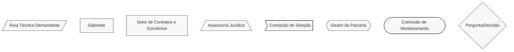

# 🫱🫲 Acordo de Cooperação

## 💎 Dicas

| Item | Resposta |
|------|----------|
| **📢 Precisa de Chamamento Público?** | Não, salvo quando o objeto envolver comodato, doação de bens ou qualquer forma de compartilhamento de recurso patrimonial (art. 29 da [Lei Federal nº 13.019/2014](https://www.planalto.gov.br/ccivil_03/_ato2011-2014/2014/lei/L13019compilado.htm) / art. 18, § 1º do [Decreto nº 47.132/2017](https://www.almg.gov.br/legislacao-mineira/texto/DEC/47132/2017/?cons=1)) |
| **🤝 Tipos de parceiros** | Organizações da sociedade civil (OSCs) |
| **💰 Envolve transferência de recursos?** | Não: instrumento para parcerias sem transferência de recursos financeiros (art. 2º, inciso VIII-A da Lei) |
| **⏳ Vigência máxima** | Não há prazo máximo explícito na lei. Vigência deve ser definida conforme objeto e necessidades da cooperação |
| **🔒 Exige prestação de contas formal?** | Simplificada: apenas relatório de execução focado em resultados (art. 71, parágrafo único do Decreto)   • Apresentação pela OSC: até 90 dias após término da parceria ou ao fim de cada exercício (se durar mais de 1 ano) (art. 69 da Lei)   • Análise pela administração: até 150 dias do recebimento (art. 71 da Lei) |
| **👮🏻 Exige gestor/fiscal designado?** | Sim: gestor da parceria obrigatório (art. 2º, inciso IX do Decreto / art. 41, inciso IX do Decreto) para acompanhamento da execução, orientação à OSC e emissão de relatórios (arts. 61 e 62 da Lei) à Comissão de Monitoramento e Avaliação (art. 60 do Decreto) |
| **🛣️ Plano de trabalho obrigatório?** | Sim, mas simplificado: contém dados da OSC, descrição do objeto, justificativa, equipe de contato, estimativa de duração, cronograma físico e indicadores (art. 26, § 3º do Decreto) |

---

## 📌 Definição

Instrumento jurídico para formalizar parcerias entre a administração pública e organizações da sociedade civil, **propostas por qualquer uma das partes**, para consecução de finalidades de interesse público e recíproco **que não envolvam a transferência de recursos financeiros** (art. 2º, inciso VIII-A da Lei 13.019/2014).

---

## 🏛️ Regulamentação

[Lei Federal nº 13.019/2014](https://www.planalto.gov.br/ccivil_03/_ato2011-2014/2014/lei/L13019compilado.htm) (Marco Regulatório das Organizações da Sociedade Civil - MROSC) e [Decreto nº 47.132/2017](https://www.almg.gov.br/legislacao-mineira/texto/DEC/47132/2017/?cons=1) (regulamenta o MROSC em MG).

> Daqui em diante, vamos mencionar simplesmente "Lei" ou "Decreto" pra falar sobre essas normas de regulamentação.

---

## 🎯 Objetivos

- Estabelecer regime de mútua cooperação para interesse público e recíproco
- Fortalecer parcerias sem custos financeiros diretos para a administração pública
- Fomentar a participação social na gestão pública
- Garantir transparência na execução de atividades de interesse público
- Simplificar procedimentos quando não há transferência de recursos financeiros
- Focar no controle de resultados e no alcance de metas

---

## 🛠️ Exemplos de aplicação no Iepha-MG:

1. Cooperação técnica para pesquisa e documentação do patrimônio cultural
2. Compartilhamento de infraestrutura (ex: uso de espaço físico para exposições)
3. Realização conjunta de eventos culturais e educativos
4. Desenvolvimento de plataformas digitais colaborativas (visitação a modelagens 3D de patrimônio, por exemplo)
5. Intercâmbio de conhecimentos e capacitações mútuas
6. Ações conjuntas de preservação e conservação de bens culturais

---

## 📋 Regras

=== "✅ Pode"

    **Características e possibilidades do instrumento:**

    - Compartilhamento de conhecimento técnico e metodológico
    - Apoio logístico e operacional
    - Realização de eventos conjuntos
    - Cooperação técnica e científica

    **Facilidades administrativas:**

    - Procedimentos simplificados quando não há transferência de recursos financeiros (art. 5º do Decreto)
    - Possibilidade de afastamento de regras desproporcionais à complexidade (art. 5º, § 2º do Decreto)
    - Monitoramento e avaliação simplificados (art. 56, § 1º do Decreto)
    - Chamamento público apenas quando envolver comodato, doação de bens ou compartilhamento de recurso patrimonial (art. 29 da Lei / art. 18, § 1º do Decreto)
    - Plano de trabalho simplificado (art. 26, § 3º do Decreto)

=== "❌ Não pode"

    ⚠️ **Proibições absolutas:**

    - Transferir recursos financeiros da administração pública para a OSC (art. 2º, inciso VIII-A da Lei)
    - Delegar funções exclusivas de Estado (regulação, fiscalização, poder de polícia) (art. 40 da Lei / art. 4º, § 3º do Decreto)
    - Celebrar com OSCs que se enquadrem nas vedações do art. 39 da Lei
    - Celebrar com OSCs que não comprovem regularidade fiscal e jurídica (art. 34 da Lei)

---

## 📢 Procedimento de Manifestação de Interesse Social (PMIS)

O PMIS é um canal democrático que permite às OSCs, movimentos sociais e cidadãos **proporem políticas públicas** ao poder público (art. 18 da Lei).

=== "🔄 Como funciona"

    1. **Apresentação da proposta** pela OSC ou cidadão (art. 19 da Lei)
    2. **Análise pela administração** de conveniência e oportunidade (art. 20 da Lei)
    3. **Consulta pública** para oitiva da sociedade sobre o tema (art. 20 da Lei)
    4. **Decisão do órgão** sobre realização ou não de chamamento público (art. 21 da Lei)

=== "📝 Requisitos"

    - **Identificação** do subscritor da proposta
    - **Indicação** do interesse público envolvido
    - **Diagnóstico** da realidade a ser modificada/desenvolvida
    - **Viabilidade** dos custos, benefícios e prazos (quando possível)

=== "⚠️ Importante"

    - **Não garante** a realização de chamamento público (art. 21 da Lei)
    - **Não impede** a OSC proponente de participar do eventual chamamento (art. 21, § 2º da Lei)
    - **É vedado** condicionar chamamento público à realização prévia de PMIS (art. 21, § 3º da Lei)

---

## ✒️ Celebração

**Regra geral:** Acordo de Cooperação é celebrado **SEM chamamento público** (art. 29 da Lei / art. 18, § 1º do Decreto).

**Exceção:** Obrigatório chamamento público **apenas quando** o objeto envolver:

- Comodato de bens (art. 29 da Lei)
- Doação de bens (art. 29 da Lei)
- Qualquer forma de compartilhamento de recurso patrimonial (art. 29 da Lei / art. 18, § 1º do Decreto)

=== "🔑 Regras-Chave"

    - **Chamamento público** apenas quando envolver compartilhamento patrimonial (art. 29 da Lei)
    - **Procedimentos simplificados** para acordos sem transferência de recursos (art. 5º do Decreto)
    - **Requisitos mínimos** para OSCs (apenas objetivos de relevância pública) (art. 33, § 1º da Lei)
    - **PMIS é facultativo** e não condiciona a celebração (art. 16, § 1º do Decreto)
    - **Monitoramento simplificado** conforme complexidade (art. 56, § 1º do Decreto)

===+ "⏱️ Prazos importantes"

    | Etapa                          | Prazo                    | Base Legal                     |
    |--------------------------------|--------------------------|--------------------------------|
    | PMIS: divulgação da proposta*  | 30 dias                  | Art. 15, § 3º do Decreto       |
    | PMIS: decisão final*           | 90 dias                  | Art. 15, § 4º do Decreto       |
    | PMIS: consulta pública*        | Mínimo 30 dias           | Art. 15, § 4º, I do Decreto    |
    | Apresentação de propostas**     | Mínimo 30 dias           | Art. 26 da Lei                 |
    | Recursos**                      | Mínimo de 5 dias         | Art. 24, § 1º do Decreto       |
    | Prestação de Contas pela OSC   | 90 dias do fim da vigência ou ao final de cada ano (se durar mais de 1 ano) | Art. 69 da Lei |
    | Análise da Prestação de Contas pelo IEPHA-MG | 150 dias do recebimento da prestação de contas | Art. 71 da Lei |

    *Opcional (art. 18 da Lei)

    **Apenas quando há compartilhamento patrimonial

---

## 🛣️ Plano de trabalho

**Elementos da proposta** (art. 26, § 3º do Decreto):

- **Dados da OSC** e, se for o caso, do interveniente
- **Descrição completa** do objeto da cooperação
- **Justificativa** para celebração e interesse público
- **Equipe de contato** responsável pela execução
- **Estimativa de duração** da vigência
- **Cronograma físico** de execução
- **Indicadores e meios** para aferição do cumprimento das metas

> **Importante**: O plano de trabalho em Acordos de Cooperação é simplificado, focando na descrição das atividades e resultados esperados.

---

## 👀 Monitoramento e controle

**Monitoramento simplificado** (art. 56, § 1º do Decreto). O **gestor da parceria** deve (arts. 61 e 62 da Lei):

- Acompanhar a execução das atividades
- Orientar a OSC durante a execução
- Emitir relatório técnico simplificado de monitoramento
- Informar irregularidades ao superior hierárquico

**Flexibilidade**: As regras de monitoramento podem ser afastadas quando a exigência for desproporcional à complexidade do acordo, mediante justificativa prévia e anuência do administrador público (art. 5º, § 2º do Decreto).

---

## 🔒 Prestação de contas

Simplificada e focada em resultados (art. 71, parágrafo único do Decreto).

=== "📋 Documentos"

    **Documentos exigidos:**

    1. **Relatório de execução simplificado** - comprovação do alcance das metas cooperativas
    2. **Documentos complementares** previstos no plano de trabalho (quando aplicável)
    3. **Comprovação de uso** de bens cedidos (quando houver compartilhamento patrimonial)

    **Prazos da prestação de contas** (art. 63 e seguintes da Lei):

    - **OSC**: apresentar prestação de contas até 90 dias após o término da parceria ou ao fim de cada exercício, se a parceria durar mais de 1 ano
    - **Administração**: analisar em até 150 dias do recebimento da prestação de contas

=== "💣 Em caso de não cumprimento"

    Se **não houver cumprimento dos compromissos assumidos**, o gestor da parceria deve:
    
    - Solicitar esclarecimentos à OSC
    - Aplicar medidas administrativas previstas no instrumento
    - Informar superiores hierárquicos sobre irregularidades
    - Adotar providências cabíveis conforme a gravidade

---

## 🔍 Saiba mais!

Modelos e documentos de referência podem ser encontrados na nossa [Biblioteca](../../biblioteca/index.md). Mas, pra facilitar, a APPI/IEPHA-MG fez uma seleção de documentos pra você:

**Modelos disponíveis no [Portal Sigcon-Saída](https://sigconsaida.mg.gov.br/padronizacoes-parcerias/):**

- [Modelo de Encaminhamento de Proposta para o Procedimento de Manifestação de Interesse Social](https://www.sigconsaida.mg.gov.br/wp-content/uploads/arquivos/padronizacao/mrosc_modelo_proposta_manifetacao_interesse_social.docx)
- [Modelo de Edital de Chamamento Público – Acordo de Cooperação](https://www.sigconsaida.mg.gov.br/wp-content/uploads/arquivos/padronizacao/modelo_edital_chamamento_publico_acordo_cooperacao.docx)
- [Minuta de Acordo de Cooperação](https://www.sigconsaida.mg.gov.br/wp-content/uploads/arquivos/padronizacao/minuta_padrao_segov_age_acordo_de_cooperacao.docx)
- [Modelo de Proposta de Plano de Trabalho para Acordo de Cooperação](https://www.sigconsaida.mg.gov.br/wp-content/uploads/arquivos/padronizacao/acordo_cooperacao_modelo_proposta_plano_trabalho.docx)
- [Modelo de Plano de Trabalho para Acordo de Cooperação](https://www.sigconsaida.mg.gov.br/wp-content/uploads/arquivos/padronizacao/acordo_cooperacao_modelo_plano_trabalho.docx)
- [Modelo de Termo de Designação de Comissão de Seleção](https://www.sigconsaida.mg.gov.br/wp-content/uploads/arquivos/padronizacao/modelo_resolucao_designacao_comissao_selecao.docx)
- [Modelo de Termo de Designação de Gestor](https://www.sigconsaida.mg.gov.br/wp-content/uploads/arquivos/padronizacao/mrosc_termo_designacao_gestor_parceria.docx)
- [Checklist de Celebração de Acordo de Cooperação](https://sigconsaida.mg.gov.br/checklists/)
- [Relatório de Monitoramento - produzido pela OSC](https://www.sigconsaida.mg.gov.br/wp-content/uploads/arquivos/padronizacao/mrosc_relatorio_monitoramento_acordo_cooperacao.docx)
- [Relatório Técnico de Monitoramento e Avaliação - produzido pelo Gestor da Parceria](https://www.sigconsaida.mg.gov.br/wp-content/uploads/arquivos/padronizacao/mrosc_relatorio_tecnico_monitoramento.docx)
- [Prestação de Contas: Relatório de Execução do Objeto](https://sigconsaida.mg.gov.br/wp-content/uploads/arquivos/padronizacao/relatorio_execucao_objeto.docx)

---

## 🔄️ Fluxograma

Todos os procedimentos do fluxograma referem-se à [Lei Federal nº 13.019/2014](https://www.planalto.gov.br/ccivil_03/_ato2011-2014/2014/lei/L13019compilado.htm) e ao [Decreto nº 47.132/2017](https://www.almg.gov.br/legislacao-mineira/texto/DEC/47132/2017/?cons=1). Diferentes formas das caixinhas significam diferentes setores responsáveis por cada atividade, conforme legenda.

```mermaid
    %%{init: { 'flowchart': { 'htmlLabels': true }, 'maxTextSize': 90000 }}%%
flowchart TD
    A@{ shape: lean-r, label: "Solicitar parceria" } --> A1@{ shape: diamond, label: "Houve PMIS sobre o tema? (art. 15 do Decreto)" }
    A1 -->|Sim| A2@{ shape: rounded, label: "Considerar resultado do PMIS realizado (art. 16 do Decreto)" } --> B
    A1 -->|Não| B@{ shape: diamond, label: "Cooperação é viável?" }
    B -->|Não| C@{ shape: rect, label: "Comunicar negativa fundamentada à área técnica" } --> FIM@{ shape: dbl-circ, label: "Fim"}
    B -->|Sim| D@{ shape: rect, label: "Levantar requisitos técnicos e operacionais" }
    D --> E@{ shape: diamond, label: "Necessita chamamento público? (art. 29 da Lei)" }
    E -->|Sim| F@{ shape: rect, label: "Desenvolver minuta de edital e acordo (art. 24, § 1º da Lei)" }
    E -->|Não| G1@{ shape: rect, label: "Desenvolver/revisar Acordo de Cooperação" }
    %% Novo fluxo para dispensa de chamamento público
    G1 --> G2@{ shape: lean-r, label: "Analisar minutas" }
    G2 --> G3@{ shape: diamond, label: "Minutas validadas?" }
    G3 -->|Não| G1
    G3 -->|Sim| G4@{ shape: rect, label: "Encaminhar processo ao setor de Contratos e Convênios" }
    G4 --> G5@{ shape: rounded, label: "Instruir processo no SEI" }
    G5 --> G6@{ shape: trap-b, label: "Análise jurídica obrigatória (art. 35, VI da Lei)" }
    G6 --> G7@{ shape: rounded, label: "Promover ajustes e anexar nota saneadora" }
    G7 --> G8@{ shape: rounded, label: "Verificar documentos da OSC parceira (art. 27 do Decreto / art. da Lei)" }
    G8 --> G9@{ shape: diamond, label: "OSC habilitada?" }
    G9 -->|Não| C
    G9 -->|Sim| Y
    F --> H@{ shape: lean-r, label: "Analisar minutas" }
    H --> J@{ shape: diamond, label: "Minutas validadas?" }
    J -->|Não| F
    J -->|Sim| K@{ shape: rect, label: "Encaminhar processo ao setor de Contratos e Convênios" }
    K --> L@{ shape: rounded, label: "Instruir processo no SEI" }
    L --> M@{ shape: trap-b, label: "Análise jurídica obrigatória (art. 35, VI da Lei)" }
    M --> N@{ shape: rounded, label: "Promover ajustes e anexar nota saneadora" }
    N --> O@{ shape: rounded, label: "Constituir comissão de seleção (art. 20 do Decreto)" }
    O --> P@{ shape: rect, label: "Publicar edital com 30 dias de antecedência (art. 26 da Lei)" }
    P --> Q@{ shape: odd, label: "Receber propostas das OSCs (art. 22 do Decreto)" }
    Q --> R@{ shape: odd, label: "Análise pela comissão de seleção (art. 27 da Lei)" }
    R --> S@{ shape: rounded, label: "Homologar e divulgar resultado provisório (art. 27, § 4º da Lei)" }
    S --> T@{ shape: odd, label: "Analisar recursos se houver (art. 25 do Decreto)" }
    T --> U@{ shape: rounded, label: "Homologar resultado final (art. 27, § 6º da Lei)" }
    U --> V@{ shape: rounded, label: "Verificar documentos das OSCs selecionadas (art. 28 da Lei)" }
    V --> W@{ shape: diamond, label: "OSCs habilitadas?" }
    W -->|Não| X@{ shape: rounded, label: "Convocar próxima classificada (art. 28, § 1º da Lei)" } --> V
    W -->|Sim| Y@{ shape: rect, label: "Designar gestor da parceria (art. 2º, IX do Decreto)" }
    %% Continuação após designação do gestor (comum a ambos os fluxos)
    Y --> Z@{ shape: rect, label: "Celebrar acordo de cooperação (art. 40 do Decreto)" }
    Z --> AA@{ shape: hex, label: "Monitoramento simplificado (art. 56, § 1º do Decreto)" }
    AA --> BB@{ shape: hex, label: "Gestor emite relatórios simplificados (art. 61 da Lei)" }
    BB --> CC@{ shape: rounded, label: "OSC apresenta prestação de contas simplificada (art. 71, parágrafo único do Decreto)" }
    CC --> DD@{ shape: hex, label: "Analisar relatório de execução (proporcional à complexidade)" }
    DD --> EE@{ shape: diamond, label: "Metas cooperativas foram atingidas?" }
    EE -->|Sim| FF@{ shape: hex, label: "Aprovar prestação de contas" } --> FIM
    EE -->|Não| GG@{ shape: hex, label: "Solicitar esclarecimentos ou aplicar medidas administrativas" } --> FIM

    classDef default stroke:#333,stroke-width:1px,fill:#f8f8f8,rx:0,ry:6font-size:20px;
```

